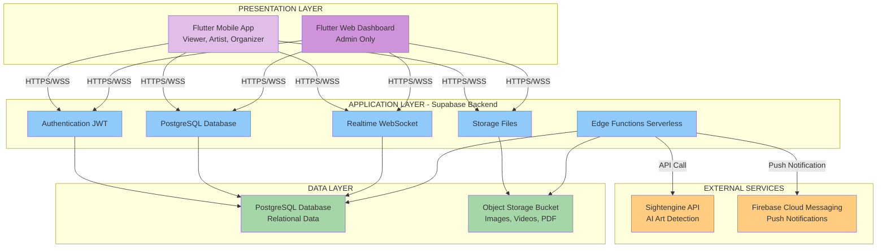
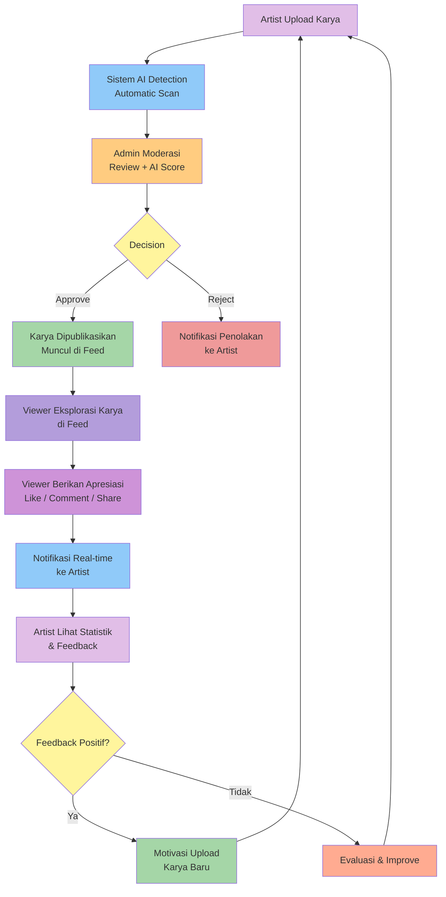
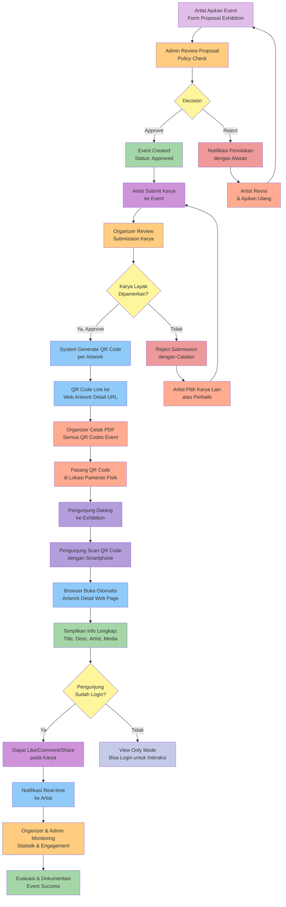
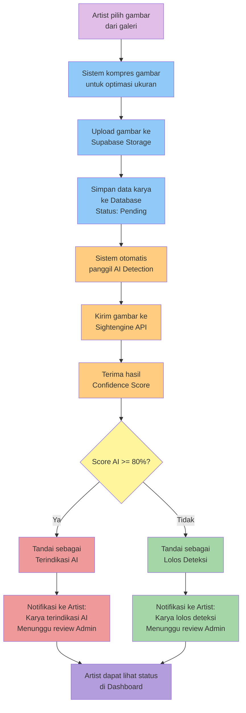
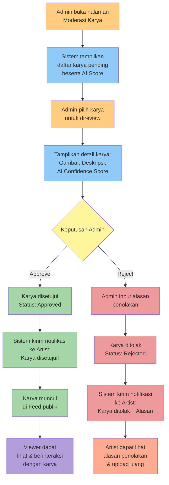
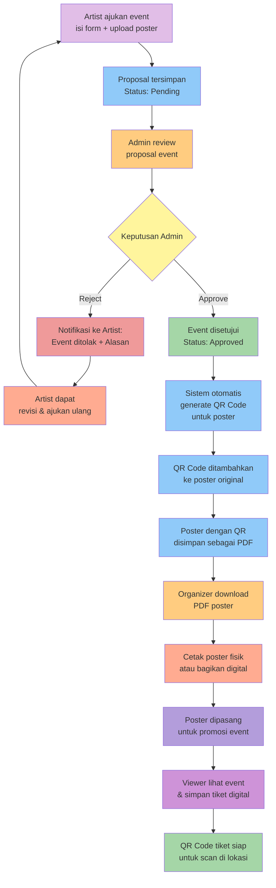
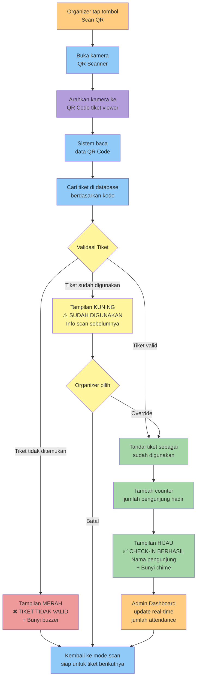
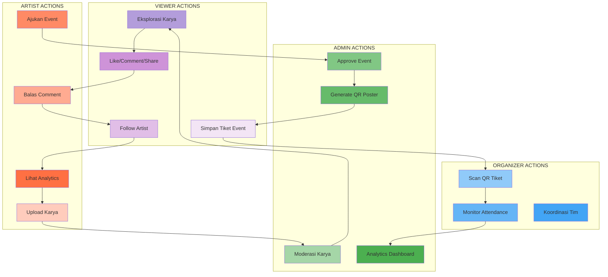
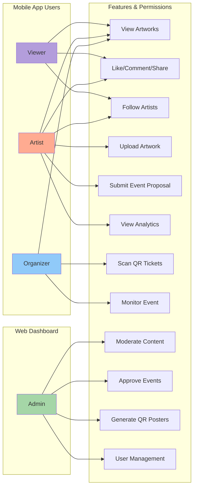

# CAMPUS ART SPACE - MERMAID DIAGRAMS

Dokumen ini berisi semua diagram dalam laporan Tugas Akhir Campus Art Space dalam format **Mermaid**. 

Anda dapat meng-copy kode Mermaid di bawah ini dan paste ke [mermaid.live](https://mermaid.live) untuk melihat visualisasi atau mengeditnya.

---

## 1. Arsitektur Three-Tier System (BAB 3.2.1)



---

## 2. Entity Relationship Diagram - Simplified (BAB 3.3.1)

```mermaid
erDiagram
    AUTH_USERS ||--|| PROFILES : "has"
    AUTH_USERS ||--|| USERS : "has_detail"
    PROFILES ||--o{ ARTWORKS : "creates"
    PROFILES ||--o{ EVENTS : "organizes"
    PROFILES ||--o{ COMMENTS : "writes"
    PROFILES ||--o{ LIKES : "gives"
    PROFILES ||--o{ ARTIST_FOLLOWS : "follows/followed_by"
    PROFILES ||--o{ NOTIFICATIONS : "receives"
    PROFILES ||--o{ FCM_TOKENS : "owns_device"
    PROFILES ||--o{ EVENT_SUBMISSIONS : "submits"
    ARTWORKS ||--o{ COMMENTS : "receives"
    ARTWORKS ||--o{ LIKES : "receives"
    ARTWORKS ||--o{ EVENT_SUBMISSIONS : "submitted_to"
    EVENTS ||--o{ EVENT_SUBMISSIONS : "has_submissions"
    EVENTS ||--o{ NOTIFICATIONS : "triggers"
    ARTWORKS ||--o{ NOTIFICATIONS : "triggers"
    
    AUTH_USERS {
        uuid id PK
        varchar email
        varchar encrypted_password
        timestamp email_confirmed_at
        timestamp created_at
        jsonb raw_user_meta_data
    }
    
    PROFILES {
        uuid id PK_FK
        timestamp created_at
        text role
        text username
    }
    
    USERS {
        uuid id PK_FK
        timestamp created_at
        text name
        text email
        text role
        text specialization
        text bio
        jsonb social_media
        text profile_image_url
    }
    
    ARTWORKS {
        bigint id PK
        timestamp created_at
        text title
        text description
        text media_url
        text external_link
        text category
        text status
        uuid artist_id FK
        bigint likes_count
        text artist_name
        text artwork_type
        text thumbnail_url
        bigint views_count
        bigint shares_count
        real ai_generated_score
        boolean is_ai_suspected
    }
    
    EVENTS {
        uuid id PK
        timestamp created_at
        text title
        text content
        timestamp event_date
        text location
        text image_url
        text status
        uuid artist_id FK
        text rejection_reason
        uuid organizer_id FK
    }
    
    COMMENTS {
        uuid id PK
        timestamp created_at
        uuid user_id FK
        bigint artwork_id FK
        text content
    }
    
    LIKES {
        uuid id PK
        timestamp created_at
        uuid user_id FK
        bigint artwork_id FK
    }
    
    EVENT_SUBMISSIONS {
        uuid id PK
        timestamp created_at
        uuid event_id FK
        bigint artwork_id FK
        uuid artist_id FK
        text status
        text curator_note
    }
    
    ARTIST_FOLLOWS {
        uuid id PK
        uuid follower_id FK
        uuid artist_id FK
        timestamp created_at
    }
    
    NOTIFICATIONS {
        uuid id PK
        timestamp created_at
        uuid user_id FK
        text type
        text title
        text message
        boolean is_read
        bigint artwork_id FK
        uuid event_id FK
        uuid submission_id FK
        text action_url
        text icon_type
    }
    
    FCM_TOKENS {
        uuid id PK
        timestamp created_at
        timestamp updated_at
        uuid user_id FK
        text token
        text device_id
        text platform
        boolean is_active
    }
    
    CATEGORIES {
        uuid id PK
        timestamp created_at
        text name
    }
    
    ANNOUNCEMENTS {
        uuid id PK
        timestamp created_at
        text tittle
        text content
    }
```

---

## 3. Siklus Publikasi dan Apresiasi Karya (BAB 2.3.1)



---

## 4. Siklus Penyelenggaraan Event Hybrid - Exhibition System (BAB 2.3.2)



---

## 5. Flow Upload Artwork dengan AI Detection (BAB 3.4.1)



---

## 6. Flow Admin Moderasi Karya (BAB 3.4.2)



---

## 7. Flow Event Management & QR Poster Generation (BAB 3.4.3)



---

## 8. Flow QR Ticket Scanning di Lokasi Event (BAB 3.4.4)



---

## 9. Interaksi Multi-Aktor dalam Sistem (BAB 2.3)



---

## 10. Role-Based Access Control (RBAC) Matrix



---

## Cara Menggunakan Diagram Ini:

1. **Copy kode Mermaid** dari salah satu section di atas
2. Buka [mermaid.live](https://mermaid.live)
3. **Paste kode** di editor sebelah kiri
4. Diagram akan otomatis ter-render di sebelah kanan
5. Anda bisa **edit** kode untuk customize diagram
6. **Export** diagram sebagai PNG, SVG, atau PDF untuk dimasukkan ke laporan

## Tips Editing:

- Ubah warna dengan mengubah value `fill:` di `style` statements
- Tambah node baru dengan format: `NodeID[Label Text]`
- Tambah edge/connection dengan `-->` (arrow) atau `---` (line)
- Untuk flowchart, gunakan shapes berbeda:
  - `[]` = rectangle
  - `()` = rounded rectangle
  - `{}` = diamond (decision)
  - `[[]]` = subroutine
  - `[()]` = stadium/pill

## Referensi Mermaid Syntax:

- Official Docs: https://mermaid.js.org/intro/
- Flowchart: https://mermaid.js.org/syntax/flowchart.html
- Sequence Diagram: https://mermaid.js.org/syntax/sequenceDiagram.html
- ER Diagram: https://mermaid.js.org/syntax/entityRelationshipDiagram.html

---

**Note:** Semua diagram ini dapat di-integrate langsung ke Markdown files yang support Mermaid rendering (GitHub, GitLab, Notion, VS Code dengan extension, dll) dengan membungkus kode dalam code block:

\```mermaid
[kode mermaid di sini]
\```
