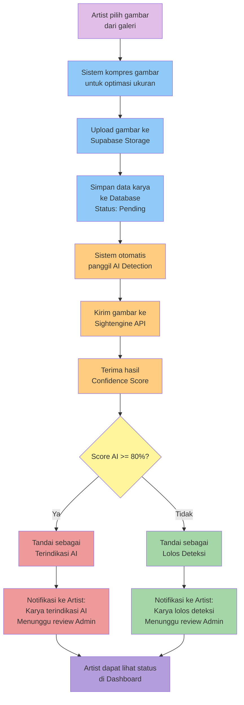
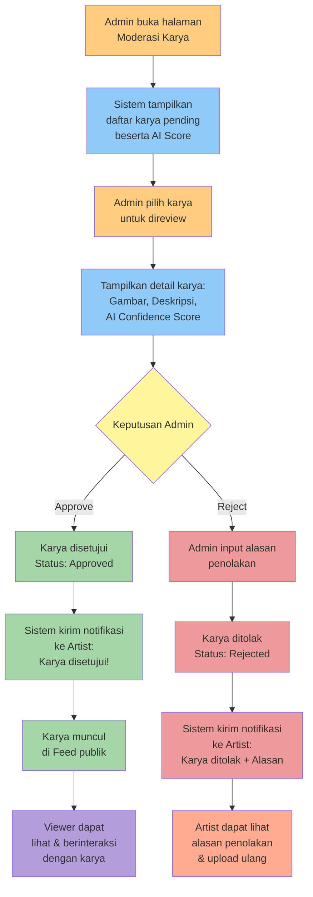
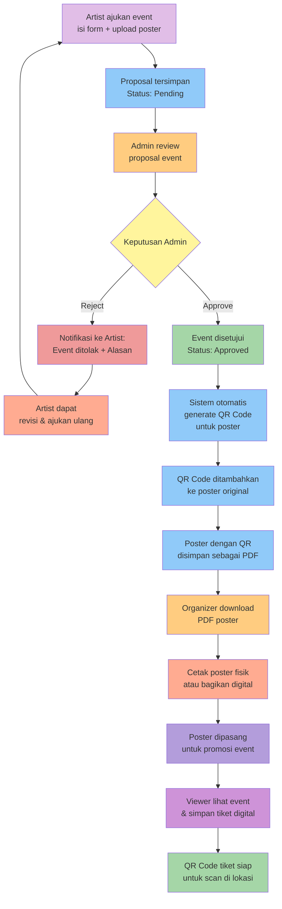
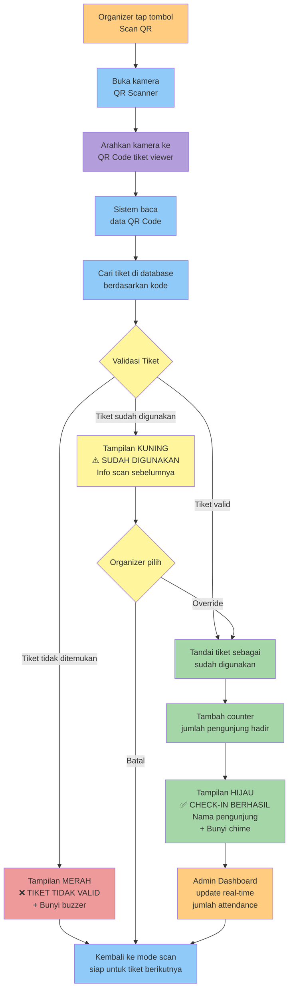

# LAPORAN TUGAS AKHIR SEMESTER

## PENGEMBANGAN APLIKASI CAMPUS ART SPACE: EKOSISTEM DIGITAL TERINTEGRASI UNTUK KOMUNITAS SENI KAMPUS BERBASIS FLUTTER DAN SUPABASE

---

**Disusun Oleh:**  
[Nama Mahasiswa]  
[NIM]

**Program Studi:**  
[Nama Program Studi]

**Fakultas:**  
[Nama Fakultas]

**Universitas Negeri Padang**  
**2025**

---

# BAB 1  
# PENDAHULUAN

## 1.1 Latar Belakang

Di lingkungan perguruan tinggi seperti Universitas Negeri Padang, terdapat beragam talenta seniman muda yang menghasilkan karya berkualitas di berbagai bidang seni visual dan audio. Namun, potensi ini belum termanfaatkan optimal akibat beberapa kendala utama yang dihadapi komunitas seni kampus.

**Minimnya Eksposur Karya Seniman Kampus**  
Seniman kampus menghadapi tantangan dalam memperoleh visibilitas yang memadai. Pameran seni konvensional bersifat periodik dan terbatas ruang-waktu, tidak mengakomodasi kebutuhan publikasi berkelanjutan. Fragmentasi media publikasi (galeri fisik, media sosial umum, platform berbeda) menciptakan pengalaman terpecah bagi penikmat seni dan mengurangi potensi interaksi konstruktif antara seniman dengan audiens.

**Ketiadaan Wadah Terpusat untuk Komunitas Seni**  
Platform media sosial umum (Instagram, Facebook, Twitter) memiliki keterbatasan fundamental untuk konteks seni kampus: tidak dirancang untuk kurasi karya seni, tidak menyediakan kategorisasi berbasis medium artistik, dan tidak terintegrasi dengan manajemen event kampus. Ketiadaan wadah terpusat yang memfasilitasi apresiasi karya, diskusi, dan pengelolaan event mengakibatkan komunitas seni kampus beroperasi terisolasi.

**Tantangan Integritas Karya di Era Generative AI**  
Teknologi Generative AI (Midjourney, DALL-E, Stable Diffusion) menghadirkan dilema etis terkait integritas karya seni. Kemampuan membedakan karya manual seniman dengan karya AI-generated menjadi persoalan penting dalam kompetisi atau kurasi kampus. Tanpa sistem verifikasi, risiko tercampurnya karya AI dengan karya manual dapat menciptakan kompetisi tidak seimbang dan mengikis kepercayaan komunitas terhadap platform.

**Inefisiensi Manajemen Event Seni Kampus**  
Pengelolaan event seni kampus masih bergantung pada metode konvensional dengan koordinasi manual intensif. Proses pengajuan proposal, persetujuan administratif, promosi, distribusi tiket, dan validasi kehadiran dilakukan terpisah tanpa sistem terintegrasi. Metode tiket kertas atau daftar hadir manual rentan pemalsuan dan kesulitan pencatatan statistik, menghambat pengembangan ekosistem event yang profesional dan terukur.

## 1.2 Rumusan Masalah

1. Bagaimana merancang platform digital terpadu yang meningkatkan eksposur karya seniman kampus sekaligus memfasilitasi interaksi sosial komunitas seni?

2. Bagaimana mengintegrasikan teknologi deteksi AI untuk mendukung kurasi dan moderasi karya seni guna menjaga integritas platform?

3. Bagaimana merancang sistem manajemen event yang mendigitalkan siklus pengelolaan kegiatan seni kampus mulai dari pengajuan proposal hingga validasi kehadiran berbasis QR Code?

4. Bagaimana mengimplementasikan sistem kontrol akses berbasis peran (Role-Based Access Control) yang memisahkan hak akses antara pengguna umum (Viewer, Artist, Organizer) dan administrator sistem?

## 1.3 Tujuan Penelitian

**Tujuan Umum:**  
Membangun ekosistem digital terintegrasi sebagai wadah publikasi, interaksi sosial, dan manajemen event untuk komunitas seni kampus menggunakan teknologi Flutter dan Supabase.

**Tujuan Khusus:**

1. Menyediakan platform publikasi terstruktur berdasarkan kategori seni agar karya seniman kampus dapat ditemukan, diapresiasi, dan dibagikan secara luas dalam satu wadah terpusat.

2. Mengimplementasikan fitur interaksi sosial (like, comment, share, follow) yang dirancang khusus untuk konteks apresiasi karya seni, menciptakan dialog aktif antara seniman dan penikmat seni.

3. Mengintegrasikan API deteksi AI (threshold 80%) sebagai decision support system bagi administrator dalam moderasi, bukan sebagai mekanisme penolakan otomatis, menjaga keseimbangan transparansi dan kebebasan berekspresi.

4. Mendigitalkan manajemen event seni kampus: pengajuan proposal melalui mobile app, persetujuan admin via web dashboard, generasi poster dengan QR Code, validasi kehadiran via scanning, dan pencatatan statistik real-time.

5. Menerapkan Role-Based Access Control (RBAC) yang memisahkan hak akses empat peran utama (Viewer, Artist, Organizer, Admin) dengan autentikasi ganda untuk pengguna umum dan administrator.

6. Menghadirkan pengalaman pengguna modern dengan desain Glassmorphism (dark mode, elemen transparan, gradient background) yang sesuai identitas komunitas seni kreatif.

## 1.4 Manfaat Penelitian

**Manfaat Akademis:**  
Memberikan kontribusi pada bidang Human-Computer Interaction (HCI) dalam konteks aplikasi seni kampus, menyajikan studi kasus implementasi Flutter-Supabase integration, dan mengeksplorasi penerapan AI Art Detection dalam sistem moderasi konten.

**Manfaat Praktis:**

- **Seniman Kampus:** Platform publikasi profesional yang meningkatkan visibilitas karya, memfasilitasi portofolio digital, dan membuka peluang kolaborasi.
- **Penikmat Seni:** Akses terpusat ke karya seni kampus, memfasilitasi apresiasi dan diskusi, serta informasi event terkini.
- **Organizer Event:** Digitalisasi alur kerja dari promosi hingga validasi kehadiran menggunakan QR Code.
- **Administrator:** Alat moderasi didukung AI dan dashboard analitik untuk monitoring aktivitas komunitas seni.
- **Institusi Pendidikan:** Ekosistem digital yang mendukung visi kampus sebagai pusat seni dan budaya, dengan dokumentasi dan arsip karya terstruktur.

## 1.5 Batasan Masalah

1. **Ruang Lingkup Pengguna:** Komunitas internal kampus Universitas Negeri Padang (mahasiswa, dosen, civitas akademika).

2. **Kategori Karya Seni:** Seni visual dan audio (lukisan, fotografi, videografi, desain grafis, musik/audio). Seni pertunjukan langsung tidak termasuk dalam cakupan manajemen karya digital.

3. **Platform Teknologi:** Flutter (frontend mobile/web) dan Supabase (backend). Tidak dilakukan perbandingan dengan teknologi alternatif.

4. **Sistem Deteksi AI:** API pihak ketiga dengan threshold tetap 80%. Tidak mencakup pengembangan model machine learning kustom.

5. **Manajemen Event:** Fokus pada digitalisasi alur pengajuan, persetujuan, promosi, dan validasi kehadiran. Logistik fisik, manajemen vendor, atau pengelolaan anggaran di luar cakupan.

6. **Keamanan:** Autentikasi dan otorisasi berbasis Supabase Auth dengan RBAC. Penetration testing atau audit keamanan komprehensif tidak termasuk dalam lingkup penelitian.

## 1.6 Sistematika Penulisan

**BAB 1: PENDAHULUAN** - Latar belakang, rumusan masalah, tujuan, manfaat, batasan masalah, dan sistematika penulisan.

**BAB 2: ANALISIS PENGGUNA DAN KEBUTUHAN SISTEM** - Profil empat aktor (Viewer, Artist, Organizer, Admin) dan pola interaksi dalam ekosistem aplikasi.

**BAB 3: ARSITEKTUR SISTEM DAN PERANCANGAN DATABASE** - Arsitektur client-server Flutter-Supabase, skema database relasional, integrasi API, dan manajemen state.

**BAB 4: IMPLEMENTASI LAYANAN DAN FITUR APLIKASI** - Detail implementasi fitur berdasarkan peran pengguna dan layanan yang ditawarkan.

**BAB 5: KESIMPULAN DAN SARAN** - Kesimpulan pencapaian penelitian dan rekomendasi pengembangan masa depan.

---

# BAB 2  
# ANALISIS PENGGUNA DAN KEBUTUHAN SISTEM

## 2.1 Pendahuluan

Aplikasi Campus Art Space dirancang sebagai ekosistem digital multi-aktor yang mengakomodasi kebutuhan beragam pemangku kepentingan dalam komunitas seni kampus. Pemahaman mendalam terhadap profil pengguna, kebutuhan fungsional, dan pola interaksi antarpengguna menjadi fondasi penting dalam perancangan sistem yang efektif dan relevan. Bab ini menguraikan empat peran utama (*role*) dalam aplikasi, yaitu **Viewer** (Penikmat Seni), **Artist** (Seniman/Kreator), **Organizer** (Panitia Event), dan **Admin** (Administrator Sistem), beserta kebutuhan dan interaksi mereka dalam membentuk ekosistem sosial yang dinamis.

## 2.2 Profil dan Kebutuhan Aktor Sistem

### 2.2.1 Viewer (Penikmat Seni)

**Definisi Peran:**  
Viewer merupakan pengguna yang berperan sebagai penikmat, apresiator, dan konsumen konten seni di platform. Mereka adalah segmen terbesar dalam ekosistem aplikasi, mencakup mahasiswa, dosen, alumni, dan civitas akademika yang memiliki minat terhadap seni dan budaya kampus.

**Karakteristik Pengguna:**
- Memiliki apresiasi terhadap berbagai bentuk seni visual dan audio
- Aktif dalam interaksi sosial digital (terbiasa dengan pola interaksi media sosial)
- Mencari konten seni yang relevan dengan minat pribadi
- Berpotensi menghadiri event seni kampus
- Tidak memiliki intensi untuk mempublikasikan karya sendiri secara aktif

**Kebutuhan Fungsional:**

1. **Eksplorasi Konten Seni**
   - Menjelajahi galeri karya seni yang dikategorikan berdasarkan medium (lukisan, fotografi, videografi, desain grafis, musik/audio)
   - Melakukan pencarian karya berdasarkan kata kunci, kategori, atau nama seniman
   - Melihat feed personalisasi yang menampilkan karya terbaru atau trending
   - Mengakses detail karya lengkap dengan deskripsi, metadata, dan informasi seniman

2. **Interaksi Sosial dengan Karya**
   - Memberikan apresiasi melalui fitur *like* pada karya yang disukai
   - Menulis komentar untuk memberikan feedback, pertanyaan, atau diskusi terkait karya
   - Membagikan (*share*) karya ke platform lain atau kepada pengguna lain di dalam aplikasi
   - Menyimpan karya favorit ke koleksi pribadi untuk akses cepat di kemudian hari

3. **Partisipasi dalam Event Seni**
   - Melihat informasi lengkap event seni kampus (jadwal, lokasi, deskripsi)
   - Menyimpan tiket digital untuk event yang akan dihadiri
   - Mengakses tiket dengan QR Code yang dapat dipindai oleh organizer saat memasuki lokasi event
   - Melihat riwayat event yang pernah dihadiri

4. **Interaksi dengan Komunitas**
   - Mengikuti (*follow*) seniman favorit untuk mendapatkan notifikasi karya terbaru mereka
   - Berinteraksi melalui sistem komentar berjenjang (*threaded comments*)
   - Menerima notifikasi saat seniman yang diikuti mengunggah karya baru atau mengadakan event

**Kontribusi terhadap Ekosistem:**  
Viewer berperan sebagai audiens aktif yang memberikan validasi sosial melalui *like* dan *comment*, menciptakan engagement yang memotivasi seniman untuk terus berkarya, serta menjadi peserta event yang mendukung viabilitas kegiatan seni kampus.

---

### 2.2.2 Artist (Seniman/Kreator)

**Definisi Peran:**  
Artist adalah pengguna yang berperan sebagai kreator konten seni. Mereka adalah mahasiswa, dosen, atau anggota komunitas kampus yang aktif memproduksi karya seni dan membutuhkan platform untuk publikasi, eksposur, dan membangun portofolio profesional.

**Karakteristik Pengguna:**
- Memiliki kemampuan produksi karya seni di satu atau lebih kategori
- Membutuhkan validasi sosial dan feedback dari audiens
- Ingin membangun personal branding dan reputasi sebagai seniman
- Berpotensi menyelenggarakan event showcase atau exhibition
- Sensitif terhadap isu hak cipta dan orisinalitas karya

**Kebutuhan Fungsional:**

1. **Publikasi dan Manajemen Karya**
   - Mengunggah karya seni dengan formulir yang mencakup judul, deskripsi, kategori, dan tags
   - Melihat status moderasi karya (pending, approved, rejected)
   - Mengedit atau menghapus karya yang telah diunggah
   - Menerima feedback dari sistem AI Detection jika karya terindikasi AI-generated
   - Mengelola portofolio digital yang menampilkan semua karya yang telah disetujui

2. **Interaksi dengan Audiens**
   - Membalas komentar pada karya mereka untuk membangun engagement
   - Melihat statistik karya (jumlah views, likes, comments, shares)
   - Menerima notifikasi real-time saat ada interaksi baru pada karya
   - Melihat profil viewer yang memberikan apresiasi atau komentar

3. **Pengajuan dan Pengelolaan Event**
   - Mengajukan proposal event seni (pameran, konser, workshop) melalui formulir digital
   - Melampirkan poster event, menentukan lokasi, jadwal, dan deskripsi acara
   - Memantau status persetujuan event dari administrator
   - Menerima poster event dengan QR Code yang telah di-generate sistem setelah event disetujui
   - Mempromosikan event melalui sistem notifikasi internal aplikasi

4. **Pengembangan Reputasi**
   - Membangun follower base yang dapat menerima notifikasi karya baru
   - Mengakses dashboard analytics yang menampilkan performa karya dan pertumbuhan audiens
   - Melihat ranking atau featured status jika karya mendapatkan engagement tinggi

**Kontribusi terhadap Ekosistem:**  
Artist adalah produsen konten utama yang menghidupkan platform. Mereka menciptakan nilai konten yang dikonsumsi viewer, menginisiasi event yang memperkaya aktivitas kampus, dan membangun kultur apresiasi seni melalui kualitas karya dan interaksi yang mereka bangun.

---

### 2.2.3 Organizer (Panitia Event)

**Definisi Peran:**  
Organizer adalah pengguna yang bertanggung jawab dalam operasional pelaksanaan event seni di lokasi fisik. Mereka adalah panitia atau volunteer yang ditugaskan untuk memvalidasi kehadiran pengunjung dan memastikan kelancaran event.

**Karakteristik Pengguna:**
- Merupakan bagian dari tim penyelenggara event (bisa artist sendiri atau tim terpisah)
- Beroperasi di lokasi fisik event (on-site)
- Membutuhkan tools yang simpel, cepat, dan reliable untuk validasi tiket
- Tidak memerlukan akses ke fitur moderasi konten atau manajemen sistem

**Kebutuhan Fungsional:**

1. **Validasi Kehadiran Pengunjung**
   - Mengakses fitur QR Code scanner melalui aplikasi mobile
   - Memindai QR Code pada tiket digital pengunjung yang datang ke event
   - Menerima feedback visual (success/error) secara instant setelah scanning
   - Melihat informasi pengunjung (nama, status tiket valid/invalid/sudah digunakan)

2. **Monitoring Real-time Event**
   - Melihat jumlah total pengunjung yang sudah check-in
   - Melihat kapasitas event dan sisa kuota (jika dibatasi)
   - Mengakses daftar pengunjung yang telah tervalidasi
   - Melaporkan masalah teknis ke administrator jika terjadi error

3. **Manajemen Event Assignment**
   - Melihat daftar event yang ditugaskan untuk di-handle
   - Mengakses informasi detail event (lokasi, jadwal, kontak PIC)
   - Koordinasi dengan organizer lain dalam tim melalui sistem

**Kontribusi terhadap Ekosistem:**  
Organizer memastikan event berjalan tertib melalui sistem validasi digital yang mengeliminasi pemalsuan tiket, mempercepat proses check-in, dan menghasilkan data kehadiran yang akurat untuk keperluan evaluasi dan pelaporan event.

---

### 2.2.4 Admin (Administrator Sistem)

**Definisi Peran:**  
Admin adalah pengelola sistem yang memiliki akses penuh terhadap operasional platform melalui web dashboard. Mereka adalah staf unit kesenian kampus, moderator, atau pihak yang ditunjuk institusi untuk mengelola konten, event, dan pengguna dalam platform.

**Karakteristik Pengguna:**
- Memiliki pemahaman tentang kebijakan institusi terkait konten dan event kampus
- Bertanggung jawab atas kualitas dan integritas konten yang dipublikasikan
- Memiliki otoritas untuk menerima atau menolak karya dan event
- Membutuhkan tools analytics untuk monitoring platform

**Kebutuhan Fungsional:**

1. **Moderasi Karya Seni**
   - Melihat daftar karya yang berstatus pending approval
   - Mengakses detail karya lengkap dengan hasil AI Detection (confidence score)
   - Menyetujui (*approve*) karya yang layak dipublikasikan
   - Menolak (*reject*) karya dengan memberikan alasan penolakan yang akan diterima artist
   - Meninjau laporan false positive dari artist terkait deteksi AI
   - Melakukan manual rescan karya jika diperlukan

2. **Manajemen Event**
   - Meninjau proposal event yang diajukan artist
   - Menyetujui atau menolak event berdasarkan kelayakan dan kepatuhan terhadap kebijakan kampus
   - Menggenerate poster event dalam format PDF dengan QR Code unik setelah approval
   - Mengedit detail event jika terdapat informasi yang perlu dikoreksi
   - Membatalkan event jika terjadi force majeure atau pelanggaran kebijakan

3. **Pengelolaan Pengguna**
   - Melihat daftar seluruh pengguna terdaftar (viewer, artist, organizer)
   - Menonaktifkan atau memblokir akun yang melanggar terms of service
   - Memberikan atau mencabut role khusus (misal: upgrade viewer menjadi artist)
   - Melihat aktivitas pengguna (jumlah karya uploaded, event organized, dll)

4. **Analytics dan Monitoring**
   - Mengakses dashboard statistik platform (jumlah karya, event, pengguna aktif)
   - Melihat grafik pertumbuhan konten dan engagement
   - Menganalisis kategori seni yang paling populer
   - Memonitor performa AI Detection (rate false positive/negative)
   - Mengakses laporan kehadiran event untuk keperluan dokumentasi institusi

5. **Konfigurasi Sistem**
   - Mengatur threshold AI Detection jika diperlukan adjustment
   - Mengelola kategori seni yang tersedia di platform
   - Mengkonfigurasi notifikasi dan email templates
   - Mengelola banner atau pengumuman di homepage aplikasi

**Kontribusi terhadap Ekosistem:**  
Admin menjaga integritas dan kualitas platform melalui kurasi konten, memfasilitasi terselenggaranya event dengan proses persetujuan yang terstruktur, serta mengoptimalkan pengalaman pengguna melalui monitoring dan konfigurasi sistem yang responsif terhadap kebutuhan komunitas.

---

## 2.3 Interaksi Sosial dalam Ekosistem Aplikasi

Aplikasi Campus Art Space dirancang sebagai **social network** yang tidak hanya berfungsi sebagai galeri statis, tetapi sebagai ruang interaksi dinamis yang menghubungkan empat aktor dalam relasi sosial yang saling menguntungkan. Pola interaksi ini membentuk siklus engagement yang berkelanjutan:

### 2.3.1 Siklus Publikasi dan Apresiasi Karya

```
Artist → Upload Karya → Admin Moderasi → Approve → Publikasi
                                           ↓
Viewer → Eksplorasi Karya → Like/Comment/Share → Notifikasi ke Artist
                                           ↓
Artist → Lihat Statistik & Feedback → Motivasi Upload Karya Baru → [Loop]
```

**Mekanisme:**
1. Artist mengunggah karya melalui mobile app
2. Sistem otomatis melakukan AI Detection sebagai screening awal
3. Admin mereview karya di web dashboard dengan bantuan AI score
4. Jika disetujui, karya dipublikasikan dan muncul di feed viewer
5. Viewer memberikan apresiasi (like) dan feedback (comment)
6. Artist menerima notifikasi real-time dan melihat engagement metrics
7. Feedback positif memotivasi artist untuk terus berkarya

**Nilai Sosial:**  
Menciptakan validasi sosial yang mendorong produktivitas seniman dan membangun kultur apresiasi seni yang aktif di kampus.

---

### 2.3.2 Siklus Penyelenggaraan Event Hybrid (Exhibition System)

```
Artist → Ajukan Event → Admin Review & Approve → Event Created
                                    ↓
Artist → Submit Karya ke Event → Organizer Review Submission
                                    ↓
Organizer → Approve Karya → Sistem Generate QR Code untuk Karya
                                    ↓
Organizer → Cetak PDF Semua QR Codes → Tempelkan di Lokasi Pameran
                                    ↓
Pengunjung → Scan QR Code Karya → Web Browser → Tampilkan Artwork Detail
                                    ↓
Pengunjung → Like/Comment/Share Karya → Artist Receive Notification
                                    ↓
Organizer & Admin → Monitoring Statistik Event → Evaluasi & Dokumentasi → [Loop]
```

**Mekanisme:**
1. Artist mengajukan proposal event (pameran/exhibition) melalui aplikasi mobile
2. Admin mengevaluasi kelayakan event dan menyetujui jika sesuai kebijakan
3. Setelah event disetujui, artist dapat submit karya seni mereka ke event melalui fitur **Event Submission**
4. **Organizer** (pengelola event) mereview submission dan menyetujui karya mana yang akan ditampilkan di event
5. Setiap karya yang disetujui otomatis mendapat QR Code unik yang mengarah ke **web URL detail karya** (contoh: `https://campus-art-space.com/artwork/[id]`)
6. Organizer dapat mengakses fitur **"Cetak PDF QR Codes"** yang menghasilkan satu file PDF berisi semua QR code dari karya-karya yang terdaftar di event tersebut
7. Organizer mencetak PDF dan menempatkan QR code di samping setiap karya fisik di lokasi pameran
8. Pengunjung yang datang ke pameran dapat **scan QR Code** menggunakan smartphone mereka
9. Browser akan terbuka otomatis menampilkan halaman **Artwork Detail** yang berisi:
   - Judul dan deskripsi lengkap karya
   - Informasi artist (nama, spesialisasi, bio)
   - Media dan kategori karya
   - Link eksternal ke portfolio artist (jika ada)
   - Fitur interaksi: like, comment, share (jika sudah login)
10. Pengunjung dapat memberikan apresiasi langsung melalui web, dan artist menerima notifikasi real-time
11. **Organizer dan Admin** dapat memonitor statistik event: jumlah karya yang dipamerkan, engagement per karya, total views, dll

**Nilai Sosial:**  
Menciptakan **pengalaman hybrid exhibition** yang menggabungkan apresiasi fisik dan digital. Pengunjung tidak hanya melihat karya secara langsung, tetapi juga mendapat informasi mendalam melalui QR Code, dapat berinteraksi dengan artist secara digital, dan menyimpan karya favorit untuk dilihat kembali. Sistem ini juga memudahkan dokumentasi dan promosi karya pasca-event, karena semua karya sudah terpublikasi di platform online.

---

### 2.3.3 Interaksi Multi-Arah dalam Sistem Komentar

Fitur **comment** dirancang sebagai ruang diskusi terstruktur yang memfasilitasi dialog multi-arah:

**Pola Interaksi:**

1. **Viewer ↔ Artist**  
   - Viewer memberikan pertanyaan atau apresiasi pada karya
   - Artist membalas untuk menjelaskan proses kreatif atau berterima kasih
   - Menciptakan kedekatan antara seniman dan audiens

2. **Viewer ↔ Viewer**  
   - Diskusi antar penikmat seni tentang interpretasi karya
   - Rekomendasi karya atau seniman lain
   - Membangun komunitas apresiator seni

3. **Artist ↔ Artist**  
   - Kolaborasi dan networking antar seniman
   - Berbagi tips teknik atau tools
   - Saling memberikan feedback konstruktif

4. **Admin sebagai Moderator**  
   - Memantau diskusi untuk mencegah konten negatif atau spam
   - Memberikan klarifikasi kebijakan jika terjadi konflik
   - Menghapus komentar yang melanggar community guidelines

**Fitur Pendukung:**
- Sistem notifikasi untuk balasan komentar
- *Threaded comments* (komentar berjenjang) untuk diskusi terorganisir
- Kemampuan *like* pada komentar untuk voting diskusi berkualitas
- Laporan komentar (*report*) jika terdapat pelanggaran

---

### 2.3.4 Sistem Follow dan Notifikasi

**Mekanisme:**

1. **Viewer → Follow Artist**  
   Viewer dapat mengikuti artist favorit mereka untuk mendapatkan update otomatis.

2. **Notifikasi Otomatis:**
   - "Artist X just uploaded a new artwork: [Title]"
   - "Artist Y is hosting an event: [Event Name] on [Date]"
   - "Someone liked your comment on [Artwork Title]"
   - "Your artwork has received 50 likes!"

3. **Benefit untuk Artist:**
   - Membangun fanbase yang loyal
   - Meningkatkan reach karya baru secara organik
   - Mendapat feedback cepat dari audiens engaged

4. **Benefit untuk Viewer:**
   - Tidak ketinggalan konten dari seniman favorit
   - Feed personalisasi berdasarkan preferensi
   - Pengalaman yang mirip dengan social media mainstream namun spesifik untuk seni

---

### 2.3.5 Peran AI Detection dalam Dinamika Sosial

Fitur AI Detection bukan hanya tool teknis, tetapi memiliki implikasi sosial:

**Fungsi Sosial:**

1. **Transparansi dan Kepercayaan**  
   - Sistem memberikan informasi objektif tentang kemungkinan karya AI-generated
   - Mencegah konflik atau kontroversi terkait orisinalitas karya
   - Membangun kepercayaan komunitas terhadap integritas platform

2. **Decision Support, Bukan Judge Otomatis**  
   - Admin tetap memiliki kontrol final untuk approve/reject
   - Artist dengan karya AI-assisted dapat memberikan klarifikasi
   - Menghindari false accusation terhadap digital artist dengan style "terlalu halus"

3. **Edukasi Komunitas**  
   - Membuka diskusi tentang definisi "seni" di era AI
   - Mengedukasi viewer tentang perbedaan karya manual dan AI
   - Mendorong artist untuk transparan tentang tools yang digunakan

**Dampak pada Interaksi:**
- Artist lebih berhati-hati dalam labeling karya mereka
- Viewer lebih aware tentang perkembangan teknologi seni
- Admin memiliki data objektif untuk keputusan yang fair
- Menciptakan kultur transparansi tanpa stigma negatif terhadap AI art

---

## 2.4 Rangkuman Kebutuhan Sistem Berdasarkan Aktor

| Aktor | Platform | Kebutuhan Utama | Interaksi Sosial |
|-------|----------|-----------------|------------------|
| **Viewer** | Mobile App | Eksplorasi karya, apresiasi (like/comment/share), simpan tiket event | Mengikuti artist, diskusi di komentar, memberikan validasi sosial |
| **Artist** | Mobile App | Upload karya, ajukan event, kelola portofolio, lihat statistik | Membalas komentar, membangun fanbase, networking dengan artist lain |
| **Organizer** | Mobile App | Scan QR tiket, validasi kehadiran, monitoring event real-time | Koordinasi dengan artist dan admin terkait operasional event |
| **Admin** | Web Dashboard | Moderasi karya (AI check), approve event, kelola user, analytics | Memberikan feedback ke artist, memoderasi diskusi, mengelola komunitas |

---

## 2.5 Kesimpulan Bab

Aplikasi Campus Art Space mengintegrasikan empat peran utama dalam ekosistem sosial yang saling mendukung. **Viewer** memberikan apresiasi dan feedback, **Artist** memproduksi konten berkualitas dan menginisiasi event, **Organizer** memastikan event berjalan tertib, dan **Admin** menjaga integritas platform melalui moderasi yang didukung teknologi AI Detection. Pola interaksi multi-arah yang difasilitasi melalui fitur social network (like, comment, share, follow, notifikasi) menciptakan engagement berkelanjutan yang mengubah platform dari sekadar galeri statis menjadi **komunitas seni kampus yang hidup dan dinamis**.

---

# BAB 3  
# ARSITEKTUR SISTEM DAN PERANCANGAN DATABASE

## 3.1 Pendahuluan

Arsitektur sistem merupakan blueprint teknis yang menentukan bagaimana komponen-komponen aplikasi berinteraksi untuk menyediakan layanan kepada pengguna. Campus Art Space dibangun dengan pendekatan **client-server architecture** yang memanfaatkan teknologi modern: **Flutter** sebagai framework pengembangan antarmuka pengguna lintas platform (mobile dan web), serta **Supabase** sebagai Backend-as-a-Service (BaaS) yang menyediakan infrastruktur database, autentikasi, storage, dan real-time capabilities. Bab ini menjelaskan arsitektur sistem secara komprehensif, mulai dari layer client hingga database schema yang mendukung seluruh fungsionalitas aplikasi.

## 3.2 Arsitektur Client-Server

### 3.2.1 Gambaran Umum Arsitektur

Campus Art Space mengadopsi arsitektur **three-tier** yang memisahkan tanggung jawab antara presentation layer (client), application layer (business logic), dan data layer (database & storage).

```
┌─────────────────────────────────────────────────────────────┐
│                     PRESENTATION LAYER                      │
│  ┌─────────────────────────┐  ┌──────────────────────────┐ │
│  │   Flutter Mobile App    │  │  Flutter Web Dashboard   │ │
│  │  (Viewer, Artist,       │  │      (Admin Only)        │ │
│  │   Organizer)            │  │                          │ │
│  └───────────┬─────────────┘  └────────────┬─────────────┘ │
└──────────────┼──────────────────────────────┼───────────────┘
               │                              │
               ├──────────────┬───────────────┤
               │   HTTPS/WSS  │               │
               ▼              ▼               ▼
┌─────────────────────────────────────────────────────────────┐
│                    APPLICATION LAYER                        │
│                    (Supabase Backend)                       │
│  ┌───────────┐  ┌──────────┐  ┌─────────────┐  ┌────────┐ │
│  │ Auth      │  │ Database │  │ Storage     │  │Realtime│ │
│  │ (JWT)     │  │(PostgSQL)│  │ (Files)     │  │(WebSoc)│ │
│  └───────────┘  └──────────┘  └─────────────┘  └────────┘ │
│  ┌───────────────────────────────────────────────────────┐ │
│  │          Edge Functions (Serverless)                  │ │
│  │  - AI Detection API Call                              │ │
│  │  - PDF Generation (QR Code Poster)                    │ │
│  │  - Push Notification Service                          │ │
│  └───────────────────────────────────────────────────────┘ │
└─────────────────────────────────────────────────────────────┘
               │
               ▼
┌─────────────────────────────────────────────────────────────┐
│                       DATA LAYER                            │
│  ┌──────────────────────┐    ┌─────────────────────────┐   │
│  │ PostgreSQL Database  │    │  Object Storage Bucket  │   │
│  │ (Relational Data)    │    │  (Images, Videos, PDF)  │   │
│  └──────────────────────┘    └─────────────────────────┘   │
└─────────────────────────────────────────────────────────────┘
               │
               ▼
┌─────────────────────────────────────────────────────────────┐
│                   EXTERNAL SERVICES                         │
│  - Sightengine API (AI Art Detection)                      │
│  - Firebase Cloud Messaging (Push Notifications)           │
└─────────────────────────────────────────────────────────────┘
```

---

### 3.2.2 Presentation Layer: Flutter Client

**Flutter Mobile App (Viewer, Artist, Organizer)**

Flutter dipilih sebagai framework client karena kemampuannya menghasilkan aplikasi native untuk Android dan iOS dari single codebase, sekaligus mendukung web deployment. Ini mengurangi effort pengembangan dan maintenance secara signifikan.

**Karakteristik:**
- **UI Framework:** Material Design 3 dengan custom Glassmorphism theme
- **State Management:** Menggunakan Provider atau Riverpod untuk reactive state management
- **Routing:** Flutter Navigator 2.0 untuk deep linking dan navigation management
- **Authentication:** Supabase Auth SDK untuk login/register/logout
- **Real-time Updates:** Supabase Realtime Client untuk notifikasi dan live updates
- **Offline Capability:** Local caching dengan Hive atau SharedPreferences untuk better UX

**Modul Utama:**
1. **Auth Module:** Login, Register, Password Reset
2. **Home Module:** Feed karya seni, kategori, search
3. **Artwork Module:** Detail karya, like, comment, share
4. **Profile Module:** User profile, portofolio artist, follow system
5. **Event Module:** List event, detail event, ticket management
6. **Scanner Module:** QR Code scanner untuk organizer
7. **Upload Module:** Form upload karya dan event untuk artist

---

**Flutter Web Dashboard (Admin Only)**

Web dashboard dibangun dengan Flutter Web untuk memberikan pengalaman desktop-optimized bagi administrator. Menggunakan codebase yang sama dengan mobile app, namun dengan layout yang di-adapt untuk layar besar.

**Karakteristik:**
- **Responsive Layout:** Sidebar navigation, data tables, dashboard widgets
- **Admin-Only Access:** Diproteksi dengan role-based authentication check
- **Bulk Operations:** Support untuk moderasi batch, export data, dll
- **Rich Analytics:** Charts dan graphs menggunakan fl_chart package

**Modul Admin:**
1. **Dashboard:** Statistik platform, grafik engagement, quick actions
2. **Content Moderation:** Review pending artworks dengan AI detection info
3. **Event Management:** Approve/reject events, generate QR posters
4. **User Management:** CRUD users, manage roles
5. **Analytics:** Deep dive statistics, export reports
6. **Settings:** Platform configuration, threshold adjustment

---

### 3.2.3 Application Layer: Supabase Backend

Supabase adalah open-source Firebase alternative yang menyediakan backend infrastructure lengkap. Dipilih karena:
- **Real-time Database:** PostgreSQL dengan real-time subscription
- **Built-in Auth:** JWT-based authentication dengan row-level security
- **Storage:** Object storage untuk images, videos, PDFs
- **Edge Functions:** Serverless functions untuk custom logic
- **Auto-generated APIs:** RESTful dan GraphQL API otomatis dari schema

**Komponen Supabase:**

1. **Authentication (Supabase Auth)**
   - Provider: Email/Password (bisa di-extend ke Google, GitHub, dll)
   - JWT Token: Digunakan untuk authorize setiap request
   - Role-Based: User memiliki `role` field di metadata (viewer/artist/organizer/admin)
   - Session Management: Token refresh otomatis untuk persistent login

2. **PostgreSQL Database**
   - Relational database yang powerful dan scalable
   - Row Level Security (RLS): Security policy berbasis role di level database
   - Triggers & Functions: Business logic di database layer (misal: auto-notification)
   - Full-text Search: Untuk fitur pencarian karya

3. **Storage (Supabase Storage)**
   - Bucket: `artworks` (untuk images/videos karya seni), `events` (poster event)
   - Public URLs: Generate public URL untuk akses file
   - Security Policies: Hanya artist yang bisa upload ke artworks, admin ke events
   - Automatic Compression: Optimasi file size untuk performance

4. **Realtime (Supabase Realtime)**
   - WebSocket Connection: Untuk notifikasi real-time
   - Database Changes Subscription: Listen ke insert/update pada tabel tertentu
   - Presence: (Future) untuk status online artist
   - Broadcast: Untuk notifikasi custom events

5. **Edge Functions (Deno-based Serverless)**
   - **AI Detection Function:** Call Sightengine API saat artwork di-upload
   - **PDF Generator Function:** Generate poster QR Code dalam PDF format
   - **Notification Function:** Kirim push notification via FCM
   - **Analytics Function:** Aggregate data untuk dashboard admin

---

### 3.2.4 Data Layer: Storage & Database

**PostgreSQL Database:**  
Database relasional yang menyimpan seluruh data terstruktur aplikasi: users, artworks, comments, likes, events, tickets, dll. Schema dirancang dengan normalisasi yang baik untuk menghindari redundansi namun tetap optimal untuk query performance.

**Object Storage:**  
Menyimpan file biner (images, videos, PDFs) dengan struktur bucket yang terorganisir. Files di-reference dalam database melalui URL.

---

### 3.2.5 External Services

**Sightengine API:**  
Third-party service untuk AI art detection. Menerima image URL, return confidence score (0-1) bahwa image adalah AI-generated.

**Firebase Cloud Messaging (Optional):**  
Untuk push notification ke mobile device saat ada event penting (karya dilike, komentar baru, event approved, dll).

---

## 3.3 Perancangan Database Relasional

Database schema dirancang dengan prinsip normalisasi untuk meminimalkan redundansi data sambil mempertahankan integritas referensial. Berikut adalah tabel-tabel utama beserta relasi mereka sesuai dengan implementasi aktual sistem.

### 3.3.1 Diagram Entity Relationship (Simplified)

```
┌─────────────┐       ┌──────────────┐       ┌─────────────┐
│ auth.users  │───────│   profiles   │───────│  artworks   │
│ (Supabase)  │ 1   1 │              │ 1   ∞ │             │
└──────┬──────┘       └──┬────┬──┬───┘       └──┬────┬─────┘
       │                 │    │  │              │    │
       │ 1               │ 1  │  │ 1            │ 1  │ 1
       │                 │    │  │              │    │
       │ ∞               │ ∞  │  │ ∞            │ ∞  │ ∞
   ┌───┴──────┐    ┌─────┴──┐ │  │     ┌────────┴──┐ │
   │  users   │    │ events │ │  │     │ comments  │ │
   │ (detail) │    │        │ │  │     │           │ │
   └──────────┘    └────┬───┘ │  │     └───────────┘ │
                        │     │  │                    │
                        │ 1   │  │ 1                  │ 1
                        │     │  │                    │
                        │ ∞   │  │ ∞                  │ ∞
              ┌─────────┴───┐ │  │           ┌────────┴──────┐
              │event_       │ │  │           │    likes      │
              │submissions  │ │  │           │               │
              └─────────────┘ │  │           └───────────────┘
                              │  │
                              │  │ 1
                              │  │
                              │  │ ∞
                   ┌──────────┴──┴──────────┐
                   │   artist_follows       │
                   │   notifications        │
                   │   fcm_tokens           │
                   └────────────────────────┘
```

**Keterangan Relasi Utama:**
- `auth.users` 1:1 dengan `profiles` dan `users` (identitas & detail pengguna)
- `profiles` 1:∞ dengan `artworks` (artist membuat banyak karya)
- `profiles` 1:∞ dengan `events` (organizer mengelola banyak event)
- `artworks` 1:∞ dengan `comments` dan `likes` (karya mendapat banyak interaksi)
- `events` 1:∞ dengan `event_submissions` (event memiliki banyak submission karya)
- `event_submissions` ∞:1 dengan `artworks` (submission mereferensi karya tertentu)
- `profiles` ∞:∞ melalui `artist_follows` (relasi many-to-many follow system)
- `profiles` 1:∞ dengan `notifications` (user menerima banyak notifikasi)
- `profiles` 1:∞ dengan `fcm_tokens` (user bisa punya banyak device)

---

### 3.3.2 Penjelasan Relasi Antar-Tabel

Database Campus Art Space dirancang dengan 11 tabel utama yang saling berelasi untuk mendukung seluruh fungsionalitas aplikasi:

**Tabel Autentikasi & Profil:**
- `auth.users`: Dikelola Supabase Auth, menyimpan kredensial login
- `profiles`: Menyimpan role (admin/artist/viewer/organizer) dan username
- `users`: Menyimpan detail profil lengkap (nama, bio, spesialisasi, social media, foto profil)

**Tabel Konten Utama:**
- `artworks`: Menyimpan karya seni dengan metadata lengkap, AI detection score, dan status moderasi
- `events`: Menyimpan event exhibition dengan informasi tanggal, lokasi, dan status approval

**Tabel Interaksi Sosial:**
- `comments`: Menyimpan komentar user pada karya seni
- `likes`: Menyimpan data like user pada karya (many-to-many)
- `artist_follows`: Menyimpan relasi follow antara viewer dan artist (many-to-many)

**Tabel Event Management:**
- `event_submissions`: Menyimpan submission karya ke event untuk dikurasi organizer

**Tabel Sistem:**
- `notifications`: Menyimpan notifikasi untuk user (like, comment, approval, dll)
- `fcm_tokens`: Menyimpan token Firebase Cloud Messaging untuk push notification
- `categories`: Master data kategori seni
- `announcements`: Pengumuman dari admin yang ditampilkan di homepage

**Relasi Kunci:**
- Semua foreign key menggunakan `ON DELETE CASCADE` atau `ON DELETE SET NULL` untuk menjaga integritas referensial
- Counter fields seperti `likes_count`, `views_count`, `shares_count` di-denormalize untuk optimasi query performance
- `artist_name` di tabel `artworks` di-denormalize untuk menghindari JOIN berlebihan saat load feed

---

### 3.3.3 Row Level Security (RLS) dan Policy Database

### 3.3.3 Row Level Security (RLS) dan Policy Database

Supabase PostgreSQL mendukung Row Level Security (RLS) yang meng-enforce security di level database. Setiap query otomatis di-filter berdasarkan policy yang telah didefinisikan, sehingga tidak ada user yang bisa mengakses data di luar hak aksesnya meskipun melewati client security.

**Policy untuk Tabel `artworks`:**
- **SELECT**: Public dapat melihat artwork dengan status `approved`; Artist dapat melihat semua karya miliknya sendiri (termasuk pending/rejected)
- **INSERT**: Hanya user dengan role `artist` yang dapat upload karya
- **UPDATE**: Hanya artist owner atau admin yang dapat mengubah karya
- **DELETE**: Hanya artist owner atau admin yang dapat menghapus karya

**Policy untuk Tabel `events`:**
- **SELECT**: Public dapat melihat event dengan status `approved`; Organizer dapat melihat semua event miliknya
- **INSERT**: Hanya user dengan role `artist` atau `organizer` yang dapat mengajukan event
- **UPDATE**: Hanya organizer owner atau admin yang dapat mengubah event
- **DELETE**: Hanya admin yang dapat menghapus event

**Policy untuk Tabel `event_submissions`:**
- **SELECT**: Organizer dapat melihat semua submission untuk event miliknya; Artist dapat melihat submission miliknya sendiri
- **INSERT**: Artist dapat submit karya ke event yang masih open
- **UPDATE**: Hanya organizer event yang dapat approve/reject submission
- **DELETE**: Artist dapat withdraw submission sebelum direview

**Policy untuk Tabel `comments`, `likes`, `artist_follows`:**
- **SELECT**: Public (semua user dapat membaca)
- **INSERT**: Authenticated users only
- **UPDATE**: Hanya owner yang dapat edit (khusus comments)
- **DELETE**: Owner atau admin dapat menghapus

**Policy untuk Tabel `notifications`, `fcm_tokens`:**
- **SELECT**: Hanya user sendiri yang dapat melihat notifikasi dan token miliknya
- **INSERT**: System (via trigger) atau user sendiri
- **UPDATE**: Hanya user sendiri (untuk mark as read)
- **DELETE**: Hanya user sendiri atau admin

**Policy untuk Tabel `users`, `profiles`:**
- **SELECT**: Public (semua user dapat melihat profil orang lain)
- **UPDATE**: Hanya user sendiri yang dapat mengubah profilnya
- **DELETE**: Hanya admin atau user sendiri

**Policy untuk Tabel Master (`categories`, `announcements`):**
- **SELECT**: Public
- **INSERT/UPDATE/DELETE**: Hanya admin

**Implementasi RLS dengan Helper Function:**

```sql
-- Function untuk cek apakah user adalah admin
CREATE OR REPLACE FUNCTION is_admin()
RETURNS BOOLEAN AS $$
BEGIN
  RETURN (SELECT role FROM profiles WHERE id = auth.uid()) = 'admin';
END;
$$ LANGUAGE plpgsql SECURITY DEFINER;

-- Function untuk cek apakah user adalah artist
CREATE OR REPLACE FUNCTION is_artist()
RETURNS BOOLEAN AS $$
BEGIN
  RETURN (SELECT role FROM profiles WHERE id = auth.uid()) = 'artist';
END;
$$ LANGUAGE plpgsql SECURITY DEFINER;

-- Contoh Policy untuk artworks SELECT
CREATE POLICY "Public can view approved artworks"
ON artworks FOR SELECT
USING (status = 'approved' OR artist_id = auth.uid() OR is_admin());

-- Contoh Policy untuk artworks INSERT
CREATE POLICY "Artists can insert own artworks"
ON artworks FOR INSERT
WITH CHECK (artist_id = auth.uid() AND is_artist());
```

**Database Triggers:**

Sistem juga mengimplementasikan beberapa database triggers untuk automasi:

1. **Auto-update `likes_count`**: Trigger yang otomatis increment/decrement counter saat INSERT/DELETE di tabel `likes`
2. **Auto-create notification**: Trigger yang otomatis membuat notifikasi saat ada like, comment, atau approval
3. **Auto-update `updated_at`**: Trigger untuk update timestamp saat record dimodifikasi
4. **Cascade delete**: Saat artwork dihapus, otomatis hapus comments, likes, dan submissions terkait

Dengan kombinasi RLS dan triggers, keamanan dan integritas data terjaga di level database, tidak bergantung pada implementasi client-side yang bisa di-bypass.

---

## 3.4 Alur Data dan Komunikasi Sistem

### 3.4.1 Flow: Upload Artwork dengan AI Detection



**Penjelasan Proses:**

Proses upload karya dilakukan secara otomatis dengan bantuan teknologi AI untuk mendeteksi apakah karya merupakan hasil generasi AI atau karya original. Sistem menggunakan threshold 80% sebagai batas deteksi - jika confidence score di atas 80%, karya akan ditandai untuk review lebih lanjut oleh admin. Proses ini memberikan transparansi kepada artist tentang status karya mereka sejak awal.

**Teknologi:**
- Flutter: `image_picker` package untuk pilih gambar
- Supabase Storage: `supabase.storage.from('artworks').upload()`
- Edge Function: Deno TypeScript function
- Sightengine: REST API call dengan HTTP client

---

### 3.4.2 Flow: Admin Moderasi Karya



**Penjelasan Proses:**

Admin berperan sebagai moderator untuk memastikan semua karya yang dipublikasikan sesuai dengan standar platform. Sistem menampilkan AI confidence score sebagai referensi, namun keputusan akhir tetap ada di tangan admin. Jika karya ditolak, artist akan menerima notifikasi dengan alasan jelas sehingga dapat memperbaiki dan upload ulang.

---

### 3.4.3 Flow: Event Management & QR Code Poster



**Penjelasan Proses:**

Proses event dimulai dari pengajuan proposal oleh artist hingga pembuatan poster dengan QR Code otomatis. Sistem memfasilitasi seluruh alur dari approval admin, generasi QR Code, hingga distribusi tiket digital kepada pengunjung. QR Code pada poster digunakan untuk promosi, sedangkan QR Code tiket digunakan untuk validasi kehadiran di lokasi event.

---

### 3.4.4 Flow: Scan QR Tiket di Lokasi Event



**Penjelasan Proses:**

Sistem scanning QR tiket memberikan feedback visual yang jelas dengan kode warna (Merah = Invalid, Kuning = Sudah Digunakan, Hijau = Berhasil) dan audio feedback untuk memudahkan organizer dalam memvalidasi tiket dengan cepat. Sistem juga mencatat data kehadiran secara real-time yang dapat dimonitor oleh admin melalui dashboard.

---

## 3.5 Keamanan Sistem

### 3.5.1 Row Level Security (RLS)

Supabase PostgreSQL mendukung RLS yang enforce security di level database. Setiap query otomatis di-filter berdasarkan policy.

**Contoh Policy:**

```sql
-- Policy: Viewer hanya bisa lihat artwork yang approved
CREATE POLICY "Public can view approved artworks"
ON artworks FOR SELECT
USING (approval_status = 'approved');

-- Policy: Artist bisa lihat artwork miliknya sendiri (semua status)
CREATE POLICY "Artists can view own artworks"
ON artworks FOR SELECT
USING (auth.uid() = user_id);

-- Policy: Artist hanya bisa insert artwork ke akun sendiri
CREATE POLICY "Artists can insert own artworks"
ON artworks FOR INSERT
WITH CHECK (auth.uid() = user_id AND 
            (SELECT role FROM profiles WHERE id = auth.uid()) = 'artist');

-- Policy: Admin bisa update semua artwork (untuk moderasi)
CREATE POLICY "Admins can update any artwork"
ON artworks FOR UPDATE
USING ((SELECT role FROM profiles WHERE id = auth.uid()) = 'admin');
```

---

### 3.5.2 Authentication & Authorization

**JWT Token:**  
Setiap request dari client menyertakan JWT token di header `Authorization: Bearer [token]`. Token ini di-verify Supabase sebelum mengeksekusi query.

**Role-Based:**  
Role user disimpan di `profiles.role`. Setiap operasi sensitif (moderasi, upload, scan QR) di-check role-nya via RLS atau di application logic.

**Separate Login:**
- User (Viewer/Artist/Organizer) → Login via Mobile App
- Admin → Login via Web Dashboard (email domain @admin.unp.ac.id atau whitelist tertentu)

---

### 3.5.3 Data Validation

**Client-Side:**  
Flutter form validation untuk mencegah input kosong, format salah, dll.

**Server-Side:**  
Database constraints (NOT NULL, UNIQUE, FOREIGN KEY) memastikan integritas data meski ada bypass dari client.

---

## 3.6 Performa dan Scalability

### 3.6.1 Optimasi Query

- **Indexing:** Semua foreign keys dan frequent query fields punya index
- **Denormalization:** Counter fields (likes_count, comments_count) di-denormalize untuk menghindari COUNT query yang expensive
- **Pagination:** Query artwork dan comments menggunakan LIMIT & OFFSET untuk avoid loading semua data sekaligus
- **Caching:** Flutter app cache data di local storage untuk mengurangi redundant API calls

---

### 3.6.2 Image Optimization

- **Compression:** Gambar di-compress di client sebelum upload (max 2MB)
- **Thumbnail Generation:** Generate thumbnail kecil (300x300) untuk grid view, load full image hanya di detail page
- **Lazy Loading:** Infinite scroll dengan lazy load untuk feed artwork

---

### 3.6.3 Real-time Subscriptions

- **Selective Subscription:** Hanya subscribe ke notifikasi atau data yang relevan untuk user (misal: artist hanya subscribe ke artwork mereka sendiri)
- **Debouncing:** Avoid spam notifikasi dengan debounce timer

---

## 3.7 Kesimpulan Bab

Arsitektur Campus Art Space dirancang dengan pendekatan modern **client-server** yang memanfaatkan Flutter untuk cross-platform UI dan Supabase sebagai backend infrastructure yang robust. Database relasional dengan schema yang terstruktur mendukung seluruh fungsionalitas aplikasi: publikasi karya, interaksi sosial, manajemen event hybrid, dan moderasi berbasis AI. Sistem keamanan yang ketat melalui Row Level Security dan role-based access control memastikan bahwa setiap aktor hanya dapat mengakses dan memodifikasi data sesuai dengan hak akses mereka. Dengan arsitektur yang scalable dan optimasi performa yang tepat, platform ini siap untuk melayani komunitas seni kampus yang terus berkembang.

---

# BAB 4  
# IMPLEMENTASI LAYANAN DAN FITUR

## 4.1 Pendahuluan

Bab ini menguraikan implementasi konkret dari layanan dan fitur aplikasi Campus Art Space yang telah dirancang berdasarkan analisis pengguna (BAB 2) dan arsitektur sistem (BAB 3). Implementasi dikelompokkan berdasarkan **modul pengguna** untuk memberikan pemahaman yang jelas tentang bagaimana setiap aktor berinteraksi dengan sistem. Setiap layanan dijelaskan dari aspek **fungsi teknis** (bagaimana fitur bekerja secara sistem) dan **manfaat pengguna** (nilai yang diberikan kepada user). Dokumentasi ini dilengkapi dengan placeholder untuk screenshot yang akan divisualisasikan pada versi final laporan.

---

## 4.2 Modul Shared: Layanan Umum untuk Semua Pengguna

Modul Shared mencakup fitur-fitur yang dapat diakses oleh semua pengguna aplikasi mobile (Viewer, Artist, Organizer) tanpa memandang role mereka. Modul ini mencakup autentikasi, eksplorasi konten, dan pencarian.

---

### 4.2.1 Sistem Login dan Autentikasi (Authentication System)

**Deskripsi Layanan:**

Sistem Login merupakan gerbang utama aplikasi yang memastikan setiap pengguna memiliki identitas digital yang terverifikasi dan aman. Implementasi autentikasi menggunakan **Supabase Auth** dengan metode email/password, yang menghasilkan **JSON Web Token (JWT)** untuk setiap sesi login. Token ini digunakan untuk mengotorisasi setiap request ke server dan menentukan hak akses pengguna berdasarkan role yang tersimpan di database.

**Fungsi Teknis:**

1. **Registrasi Pengguna (Sign Up)**
   - User mengisi form registrasi dengan field: Full Name, Username, Email, Password, dan Role (Viewer/Artist)
   - Password di-hash menggunakan algoritma bcrypt sebelum disimpan (handled by Supabase Auth)
   - Sistem otomatis membuat record di tabel `users` (Supabase Auth) dan `profiles` (custom table)
   - Email verifikasi dikirim ke inbox user (opsional, bisa diaktifkan)
   - Setelah registrasi berhasil, user langsung ter-login dan redirect ke homepage

2. **Login Pengguna (Sign In)**
   - User memasukkan Email dan Password
   - Supabase Auth memverifikasi kredensial dengan database
   - Jika valid, sistem menggenerate JWT token dengan payload berisi `user_id` dan `role`
   - Token disimpan di secure storage perangkat (Flutter Secure Storage)
   - Sistem melakukan route navigation berdasarkan role:
     - Viewer/Artist/Organizer → Home Screen (Mobile)
     - Admin → Redirect ke Web Dashboard (tidak bisa login via mobile)

3. **Pemisahan Akses Berdasarkan Role (Role-Based Access Control)**
   - Setiap API request menyertakan JWT token di header `Authorization: Bearer [token]`
   - Server (Supabase) men-decode token untuk mendapatkan `user_id` dan query role dari tabel `profiles`
   - Row Level Security (RLS) policies di PostgreSQL otomatis memfilter data berdasarkan role
   - Contoh: Artist dapat mengakses form "Upload Karya", sedangkan Viewer tidak dapat akses halaman tersebut

4. **Session Persistence dan Auto-Logout**
   - Token memiliki expiry time (default 1 jam)
   - Sistem otomatis refresh token selama user masih aktif
   - Jika token expired dan gagal di-refresh, user di-logout otomatis untuk keamanan
   - User dapat manual logout, yang akan menghapus token dari device

**Keamanan:**

- **Password Strength Validation:** Minimal 8 karakter, kombinasi huruf dan angka
- **SQL Injection Prevention:** Prepared statements di Supabase
- **XSS Protection:** Input sanitization di client-side
- **Brute Force Protection:** Rate limiting untuk login attempts (Supabase built-in)
- **Secure Storage:** JWT token disimpan di encrypted storage, bukan plaintext SharedPreferences

**Manfaat untuk Pengguna:**

- **Keamanan Akun:** Autentikasi yang kuat melindungi data pribadi dan karya seni dari akses tidak sah
- **Personalisasi:** User mendapatkan feed dan notifikasi yang relevan berdasarkan preferensi mereka
- **Akses Mudah:** Session persistence memungkinkan user tetap login tanpa perlu input kredensial berulang kali
- **Pemisahan Role:** Memastikan setiap user hanya mengakses fitur yang relevan dengan kebutuhan mereka

**[PLACEHOLDER SCREENSHOT: Halaman Splash Screen dengan logo Campus Art Space dan animasi loading]**

**[PLACEHOLDER SCREENSHOT: Form Registrasi dengan field Full Name, Username, Email, Password, dan dropdown Role]**

**[PLACEHOLDER SCREENSHOT: Form Login dengan field Email dan Password, serta tombol "Forgot Password"]**

---

### 4.2.2 Home & Explore: Desain Glassmorphism dan Feed Karya

**Deskripsi Layanan:**

Home Screen adalah halaman utama setelah login, dirancang sebagai **social feed** yang menampilkan karya seni terbaru dari komunitas kampus. Implementasi menggunakan desain **Glassmorphism** yang memberikan estetika modern dengan elemen transparan, efek blur, dan gradient background. Halaman ini juga mencakup **Stories** untuk highlight karya trending dan **Category Grid** untuk eksplorasi berdasarkan kategori seni.

**Fungsi Teknis:**

1. **Desain Glassmorphism UI**
   - **Card Container:** Menggunakan `BackdropFilter` dengan `ImageFilter.blur(sigmaX: 10, sigmaY: 10)` untuk efek frosted glass
   - **Background:** Gradient kombinasi warna ungu gelap dan biru dengan opacity untuk depth perception
   - **Transparency:** Card artwork menggunakan opacity 0.2-0.3 dengan border subtle white/neon
   - **Shadow:** Multi-layer shadow untuk ilusi depth (offset, blur radius, spread)
   - **Animation:** Subtle shimmer effect saat hover atau scroll untuk responsiveness

2. **Top Navigation Bar**
   - Logo aplikasi di kiri atas
   - Search icon di kanan atas untuk quick access ke pencarian
   - Profile avatar di pojok kanan untuk akses ke profile screen
   - Badge notifikasi jika ada notifikasi baru (like, comment, event approval)

3. **Stories Section (Horizontal Carousel)**
   - Display 5-10 karya dengan engagement tertinggi (most liked dalam 7 hari terakhir)
   - Format: Circular avatar artist + thumbnail karya + gradient border (mirip Instagram Stories)
   - Auto-scroll dengan smooth animation atau manual swipe
   - Tap story → Navigate ke detail karya

4. **Category Chips (Horizontal Scrollable)**
   - Pill-shaped buttons untuk kategori: All, Painting, Photography, Videography, Graphic Design, Music/Audio
   - Selected category highlighted dengan warna accent (misal: neon purple)
   - Tap category → Filter feed hanya menampilkan karya dari kategori tersebut
   - "All" → Reset filter, tampilkan semua karya

5. **Feed Karya Seni (Vertical Infinite Scroll)**
   - **Layout:** Grid 2 kolom atau single column list (tergantung desain pilihan)
   - **Artwork Card Components:**
     - Thumbnail image/video dengan aspect ratio 1:1 atau 4:3
     - Overlay gradient di bagian bawah untuk text readability
     - Title karya dan nama artist
     - Kategori badge (icon atau text)
     - Quick stats: Icon like + jumlah likes, icon comment + jumlah comments
   - **Lazy Loading:** Load 20 karya pertama, fetch next 20 saat user scroll ke bottom (pagination)
   - **Pull-to-Refresh:** User swipe down dari top untuk refresh feed dan load karya terbaru

6. **Query Database:**
   ```sql
   SELECT artworks.*, profiles.full_name, profiles.username, profiles.avatar_url
   FROM artworks
   JOIN profiles ON artworks.user_id = profiles.id
   WHERE artworks.approval_status = 'approved'
   ORDER BY artworks.created_at DESC
   LIMIT 20 OFFSET 0;
   ```

7. **Interaksi Cepat:**
   - Double-tap pada card → Quick like (animasi heart popup)
   - Single-tap → Navigate ke Detail Karya screen
   - Long-press → Show context menu (Share, Report, Save to Collection)

**Manfaat untuk Pengguna:**

- **Visual Appeal:** Desain glassmorphism yang modern dan aesthetic meningkatkan pengalaman visual user
- **Discovery:** Stories dan category chips mempermudah user menemukan karya yang sesuai minat
- **Engagement:** Feed yang dinamis dan terus diperbarui membuat user betah berlama-lama di aplikasi
- **Efisiensi:** Infinite scroll dan lazy loading memastikan performa smooth tanpa lag meski konten banyak

**[PLACEHOLDER SCREENSHOT: Home Screen dengan glassmorphism effect, menampilkan gradient background ungu-biru dengan transparency effect]**

**[PLACEHOLDER SCREENSHOT: Stories section di bagian atas dengan circular avatars artist dan thumbnail karya dalam carousel horizontal]**

**[PLACEHOLDER SCREENSHOT: Category chips horizontal dengan pilihan "All", "Painting", "Photography", "Videography", "Graphic Design", "Music/Audio"]**

**[PLACEHOLDER SCREENSHOT: Feed grid 2 kolom menampilkan karya seni dengan glassmorphism cards, overlay gradient, title, artist name, dan quick stats likes/comments]**

**[PLACEHOLDER SCREENSHOT: Artwork card detail menampilkan thumbnail, title "Sunset di Pantai", artist "JohnDoe", kategori badge "Photography", 124 likes, 15 comments]**

---

### 4.2.3 Pencarian dan Filter Kategori Seni

**Deskripsi Layanan:**

Fitur Pencarian memungkinkan user untuk menemukan karya seni atau artist secara spesifik menggunakan keyword atau filter kategori. Implementasi menggunakan **full-text search** PostgreSQL untuk performa query yang cepat dan **filter multi-kriteria** untuk hasil yang presisi.

**Fungsi Teknis:**

1. **Search Bar Interface**
   - Input field di bagian atas screen dengan hint text "Cari karya atau seniman..."
   - Icon magnifying glass di kiri, icon clear (X) di kanan saat user typing
   - Real-time suggestions saat user mengetik (debounced, tunggu 500ms setelah user berhenti typing)

2. **Search Query Types:**
   
   **a. Search by Artwork Title/Description:**
   ```sql
   SELECT artworks.*, profiles.full_name
   FROM artworks
   JOIN profiles ON artworks.user_id = profiles.id
   WHERE artworks.approval_status = 'approved'
   AND (
     artworks.title ILIKE '%{keyword}%' OR
     artworks.description ILIKE '%{keyword}%' OR
     '{keyword}' = ANY(artworks.tags)
   )
   ORDER BY artworks.likes_count DESC;
   ```

   **b. Search by Artist Name:**
   ```sql
   SELECT profiles.*, COUNT(artworks.id) as artwork_count
   FROM profiles
   LEFT JOIN artworks ON profiles.id = artworks.user_id
   WHERE profiles.role = 'artist'
   AND (
     profiles.full_name ILIKE '%{keyword}%' OR
     profiles.username ILIKE '%{keyword}%'
   )
   GROUP BY profiles.id
   ORDER BY artwork_count DESC;
   ```

3. **Filter Kategori (Advanced Filter)**
   - Tap icon filter di search bar → Open bottom sheet dengan filter options
   - **Filter By Category:** Checkbox untuk multiple selection (Painting, Photography, dll)
   - **Sort By:** Dropdown dengan opsi (Most Recent, Most Liked, Most Commented, Most Viewed)
   - **Date Range:** Slider untuk filter karya dalam rentang waktu tertentu (Last 7 days, Last month, All time)
   - Apply filter → Update query dengan WHERE clauses tambahan

4. **Search Results Display:**
   - **Tab Navigation:** Switch antara "Artworks" dan "Artists"
   - **Artworks Tab:** Grid layout sama seperti feed, namun hasil di-sort berdasarkan relevance atau filter
   - **Artists Tab:** List view dengan avatar, nama, username, bio singkat, dan jumlah karya
   - **Empty State:** Jika tidak ada hasil, tampilkan ilustrasi dan text "Tidak ada hasil untuk '{keyword}'"

5. **Recent Searches (Local Storage):**
   - Simpan 10 keyword terakhir di local storage (Hive atau SharedPreferences)
   - Display di bottom search bar sebelum user mulai typing
   - Tap recent keyword → Auto-populate search bar dan execute query
   - User dapat delete individual recent search

**Manfaat untuk Pengguna:**

- **Efisiensi:** User dapat langsung menemukan karya atau artist yang dicari tanpa scroll feed secara manual
- **Presisi:** Filter multi-kriteria memastikan hasil search relevan dengan kebutuhan user
- **Personalisasi:** Recent searches memudahkan user untuk re-search query yang sering digunakan
- **Discovery:** Suggestions dan sorting options membantu user menemukan konten baru yang mungkin terlewat

**[PLACEHOLDER SCREENSHOT: Search screen dengan search bar aktif, menampilkan keyboard dan placeholder "Cari karya atau seniman..."]**

**[PLACEHOLDER SCREENSHOT: Search suggestions dropdown menampilkan recent searches: "lukisan abstrak", "fotografi landscape", "seniman john"]**

**[PLACEHOLDER SCREENSHOT: Filter bottom sheet dengan checkbox kategori (Painting, Photography, Videography checked), dropdown Sort By (Most Liked selected), dan slider Date Range]**

**[PLACEHOLDER SCREENSHOT: Search results tab "Artworks" menampilkan grid hasil pencarian dengan keyword "sunset" - menampilkan 8 karya dengan sunset theme]**

**[PLACEHOLDER SCREENSHOT: Search results tab "Artists" menampilkan list artist dengan avatar, nama "John Doe", username "@johndoe", bio "Photographer specializing in landscape", dan "45 karya"]**

---

## 4.3 Modul Artist: Layanan untuk Seniman dan Kreator

Modul Artist mencakup fitur-fitur spesifik yang hanya dapat diakses oleh user dengan role **Artist**. Modul ini fokus pada publikasi karya seni dan pengelolaan event.

---

### 4.3.1 Layanan Publikasi Karya dengan Deteksi AI

**Deskripsi Layanan:**

Layanan Publikasi Karya memungkinkan artist mengunggah karya seni mereka ke platform dengan sistem moderasi berbasis teknologi AI. Sistem secara otomatis menganalisis setiap karya yang diunggah menggunakan **Sightengine API** untuk mendeteksi apakah karya tersebut merupakan hasil generasi AI atau karya manual. Dengan threshold 80% sebagai batas deteksi, sistem memberikan transparansi penuh kepada artist tentang status karya mereka sejak awal proses upload.

**Cara Kerja Layanan:**

Proses dimulai saat artist memilih gambar atau video dari galeri perangkat mereka, kemudian mengisi informasi karya seperti judul, deskripsi, kategori seni, dan tags. Setelah artist menekan tombol upload, sistem melakukan beberapa proses secara otomatis:

1. **Kompresi dan Upload Media:** Gambar atau video dikompres untuk optimasi ukuran (maksimal 2MB untuk gambar), kemudian diunggah ke cloud storage. Sistem juga membuat thumbnail kecil untuk tampilan grid di feed.

2. **Deteksi AI Otomatis:** Segera setelah file berhasil diunggah, sistem secara otomatis memanggil API Sightengine yang akan menganalisis karya dan memberikan confidence score (0-100%). Score ini menunjukkan seberapa besar kemungkinan karya tersebut dibuat menggunakan AI generator.

3. **Notifikasi Hasil Scan:** Artist langsung menerima notifikasi real-time dengan hasil deteksi:
   - **Score < 80%:** Karya dianggap lolos deteksi AI, ditandai badge hijau dengan pesan "Karya Anda lolos deteksi AI awal, menunggu review admin"
   - **Score ≥ 80%:** Karya terindikasi AI-generated, ditandai badge merah dengan pesan "Karya terindikasi AI dengan confidence X%, akan direview manual oleh admin"

4. **Review Admin:** Semua karya, terlepas dari hasil AI detection, tetap melalui proses review manual oleh admin untuk memastikan kesesuaian dengan kebijakan platform. Admin dapat melihat AI confidence score sebagai referensi, namun keputusan akhir tetap di tangan admin.

**Status dan Feedback Karya:**

Artist dapat memantau status semua karya mereka melalui dashboard **My Artworks** dengan tiga kemungkinan status:

- **Pending (Kuning):** Karya sedang menunggu review admin. Ditampilkan bersama AI confidence score dengan indikator warna (hijau untuk 0-50%, kuning untuk 51-79%, merah untuk 80-100%).

- **Approved (Hijau):** Karya telah disetujui admin dan otomatis dipublikasikan di feed publik. Semua user dapat melihat dan berinteraksi dengan karya tersebut.

- **Rejected (Merah):** Karya ditolak admin dengan alasan yang jelas ditampilkan. Artist dapat melihat alasan penolakan (misalnya: "Karya terindikasi AI-generated" atau "Konten melanggar kebijakan") dan memilih untuk menghapus atau upload ulang karya yang berbeda.

**Transparansi Sistem AI Detection:**

Threshold 80% dipilih untuk memberikan keseimbangan antara sensitivitas deteksi dan menghindari false positive. Karya dengan style digital yang sangat halus atau terlalu sempurna kadang dapat terdeteksi sebagai AI meski dibuat manual - untuk kasus ini, artist dapat memberikan klarifikasi kepada admin, dan admin memiliki wewenang untuk melakukan override approval jika konteks mendukung.

**Manfaat untuk Artist:**

- **Transparansi Penuh:** Mengetahui status karya secara real-time, tidak perlu menunggu tanpa kepastian
- **Feedback Konstruktif:** Jika ditolak, artist mendapat penjelasan jelas sehingga dapat memperbaiki upload berikutnya
- **Perlindungan Integritas:** Sistem AI detection menjaga kualitas platform agar tetap fokus pada karya original
- **Proses Cepat:** Upload dan deteksi AI selesai dalam hitungan detik, review admin biasanya 1-3 hari
- **Motivasi Positif:** Karya yang approved langsung terlihat komunitas, meningkatkan engagement dan apresiasi

**[PLACEHOLDER SCREENSHOT: Form upload karya dengan field Title, Description, Category, dan Tags]**

**[PLACEHOLDER SCREENSHOT: Dashboard My Artworks menampilkan karya dengan status Pending (AI confidence 45% - hijau), Approved, dan Rejected]**

**[PLACEHOLDER SCREENSHOT: Notifikasi "Karya Terindikasi AI" dengan confidence score 87% dan penjelasan akan direview admin]**

---

### 4.3.2 Layanan Partisipasi Event: Submission Karya ke Event

**Deskripsi Layanan:**

Layanan Partisipasi Event memungkinkan artist untuk mengirimkan (submit) karya seni mereka ke event-event yang telah dibuat oleh organizer - seperti pameran seni, kompetisi, atau exhibition. Berbeda dengan upload karya biasa yang langsung muncul di feed publik, karya yang disubmit ke event harus melewati review dari organizer event untuk menentukan kelayakan ditampilkan.

**Cara Kerja Layanan:**

**1. Menemukan Event yang Terbuka**

Artist dapat menjelajahi event-event yang sedang membuka submission melalui tab Event di aplikasi. Event ditampilkan dengan informasi lengkap: tema, tanggal event, deadline submission, kategori karya yang diterima, dan jumlah slot yang tersedia. Filter membantu artist menemukan event yang sesuai dengan jenis karya mereka (lukisan, fotografi, video, dll).

**2. Memilih Karya untuk Disubmit**

Ketika artist tertarik dengan suatu event dan tap tombol "Submit Karya", sistem menampilkan daftar karya artist yang sudah approved (karya yang ada di portofolio mereka). Artist memilih satu atau beberapa karya yang ingin ditampilkan di event tersebut, kemudian dapat menambahkan catatan khusus untuk organizer (misalnya: alasan memilih karya tersebut, konteks karya terkait tema event, atau informasi teknis tentang display).

Jika artist ingin submit karya baru yang belum ada di portofolio, mereka dapat upload karya baru terlebih dahulu melalui fitur publikasi karya standar. Setelah karya tersebut approved oleh admin, baru bisa disubmit ke event.

**3. Review oleh Organizer Event**

Setelah submission dikirim, karya masuk ke antrian review organizer dengan status **Pending Review**. Organizer event (yang bisa jadi artist lain yang mengajukan event atau panitia yang ditunjuk) akan mereview semua submission dan memutuskan:

- **Accepted:** Karya diterima untuk ditampilkan di event. Artist menerima notifikasi "Selamat! Karya Anda diterima untuk ditampilkan di [Nama Event]"
- **Rejected:** Karya tidak sesuai dengan tema/kriteria event. Organizer memberikan alasan penolakan (misalnya: "Karya tidak sesuai tema Abstract Art" atau "Slot kategori Photography sudah penuh")

**4. Status dan Manajemen Submission**

Artist dapat memantau semua submission mereka melalui menu **My Event Submissions** dengan tampilan status:

- **Pending Review (Kuning):** Submission sedang menunggu keputusan organizer. Artist dapat menarik (withdraw) submission jika berubah pikiran.

- **Accepted (Hijau):** Karya diterima dan akan ditampilkan di event. Artist melihat informasi lengkap event (tanggal, lokasi, contact organizer) dan sistem secara otomatis generate QR Code khusus untuk karya tersebut yang akan dicetak dan dipasang di lokasi exhibition.

- **Rejected (Merah):** Submission ditolak dengan alasan dari organizer. Artist dapat submit karya lain atau mencoba event berbeda.

**QR Code untuk Exhibition:**

Karya yang accepted secara otomatis mendapat QR Code unik yang mengarah ke halaman detail karya di web/app. Organizer event dapat mendownload semua QR Code dalam satu file PDF untuk dicetak dan dipasang di samping setiap karya fisik saat exhibition berlangsung. Pengunjung yang scan QR Code akan melihat:
- Detail karya (judul, deskripsi, medium)
- Profil artist dengan link follow
- Opsi untuk like, comment, dan share karya
- Informasi tambahan yang artist cantumkan

**Manfaat untuk Artist:**

- **Eksposur Terfokus:** Karya tampil di event dengan tema spesifik, menjangkau audiens yang benar-benar tertarik dengan jenis seni tersebut
- **Kurasi Profesional:** Proses review organizer memastikan karya yang ditampilkan berkualitas dan sesuai standar event
- **Networking:** Berpartisipasi di event membuka peluang bertemu artist lain dan memperluas jaringan di komunitas seni
- **Digital Integration:** QR Code menghubungkan karya fisik dengan platform digital, memudahkan pengunjung berinteraksi dan follow artist
- **Portfolio Building:** Riwayat partisipasi di event terekam sebagai track record artist yang dapat memperkuat kredibilitas

**[PLACEHOLDER SCREENSHOT: Daftar event yang membuka submission dengan info tema, deadline, dan button Submit Karya]**

**[PLACEHOLDER SCREENSHOT: Pemilihan karya dari portofolio artist untuk disubmit ke event dengan checkbox multi-select]**

**[PLACEHOLDER SCREENSHOT: Dashboard My Event Submissions menampilkan submission dengan status Pending Review, Accepted, dan Rejected]**

**[PLACEHOLDER SCREENSHOT: Notifikasi "Karya Diterima!" dengan detail event dan QR Code yang sudah di-generate]**

---

*[BAB 4 akan dilanjutkan dengan Modul Viewer, Organizer, dan Admin pada bagian selanjutnya]*

---

## 4.4 Modul Viewer: Layanan untuk Penikmat Seni

Modul Viewer mencakup fitur-fitur yang memfasilitasi apresiasi, interaksi sosial, dan partisipasi dalam event seni. Viewer adalah segmen terbesar pengguna yang berperan sebagai audiens aktif dalam ekosistem Campus Art Space.

---

### 4.4.1 Layanan Detail Karya dan Interaksi Sosial

**Deskripsi Layanan:**

Layanan Detail Karya memberikan pengalaman menikmati karya seni secara mendalam dengan tampilan full-screen berkualitas tinggi, dilengkapi fitur zoom untuk melihat detail, dan sistem interaksi sosial (like, comment, share) yang memfasilitasi dialog antara penikmat seni dan seniman.

**Cara Kerja Layanan:**

Ketika viewer melihat karya di feed dan tertarik dengan salah satu karya, mereka dapat tap pada thumbnail untuk membuka detail lengkap. Sistem menampilkan karya dalam ukuran penuh dengan animasi transisi yang smooth (hero animation), memberikan pengalaman visual yang imersif seperti mengunjungi galeri digital.

**Fitur Utama Detail Karya:**

**1. Tampilan Full-Screen dengan Zoom**

Karya ditampilkan memenuhi layar dengan background gradient atau blur yang memperkuat fokus pada karya. Viewer dapat menggunakan gesture pinch-to-zoom untuk melihat detail brush strokes pada lukisan atau kualitas fokus pada fotografi - mirip seperti mengamati karya dari dekat di galeri fisik. Gesture swipe horizontal memungkinkan navigasi cepat ke karya lain tanpa harus kembali ke feed.

**2. Informasi Karya dan Artist**

Informasi ditampilkan dalam panel yang dapat di-scroll dari bawah layar (bottom sheet), meliputi:
- Judul dan deskripsi karya dari artist
- Profil artist (foto, nama, username) yang dapat diklik untuk melihat portofolio lengkap
- Kategori seni dan tags untuk memudahkan discovery karya serupa
- Statistik engagement: jumlah views, likes, comments, dan shares
- Tanggal upload dan informasi tambahan seperti medium atau tools yang digunakan

**3. Fitur Like (Apresiasi Cepat)**

Viewer dapat memberikan like dengan tap tombol heart atau double-tap langsung pada gambar untuk apresiasi cepat. Setiap like memberikan feedback visual berupa animasi heart dan getaran ringan pada device. Artist akan menerima notifikasi real-time saat karya mereka disukai, menciptakan koneksi langsung antara pencipta dan penikmat.

**4. Sistem Komentar Berjenjang**

Viewer dapat menulis komentar untuk memberikan apresiasi, kritik konstruktif, atau bertanya tentang karya. Sistem mendukung replies (balasan komentar) yang membentuk diskusi berjenjang - mirip forum diskusi namun fokus pada satu karya. Komentar dapat diurutkan berdasarkan terbaru atau paling disukai. Artist atau pemilik karya dapat membalas komentar, menciptakan dialog dua arah yang kaya.

**5. Berbagi Karya (Share)**

Viewer dapat membagikan karya yang mereka sukai ke berbagai platform:
- Share internal ke user lain di aplikasi
- Share eksternal ke WhatsApp, Instagram, atau social media lain
- Copy link karya untuk dibagikan manual
- Download gambar ke galeri device (dengan watermark artist untuk proteksi)

Setiap aktivitas share membantu meningkatkan visibility karya dan memperluas jangkauan artist di luar komunitas kampus.

**Manfaat untuk Viewer:**

- **Pengalaman Premium:** Tampilan full-screen dengan zoom memberikan pengalaman seperti di galeri fisik, dapat mengapresiasi detail karya dengan seksama
- **Interaksi Bermakna:** Dapat memberikan feedback langsung ke artist melalui like dan comment, bukan sekadar konsumsi pasif
- **Discovery Mudah:** Tags dan artist profile link memudahkan menemukan karya lain yang sesuai selera
- **Komunitas Aktif:** Comment section menjadi tempat diskusi seni yang konstruktif antara penikmat dan pencipta
- **Berbagi Inspirasi:** Fitur share memudahkan menyebarkan karya yang menginspirasi ke lingkaran pertemanan

**[PLACEHOLDER SCREENSHOT: Detail karya full-screen menampilkan lukisan landscape dengan glassmorphism AppBar dan bottom sheet]**

**[PLACEHOLDER SCREENSHOT: Pinch-to-zoom menampilkan detail brushstrokes pada lukisan yang di-zoom 3x]**

**[PLACEHOLDER SCREENSHOT: Bottom sheet expanded menampilkan artist info, engagement stats, dan deskripsi lengkap karya]**

**[PLACEHOLDER SCREENSHOT: Comment section dengan nested replies, menampilkan diskusi antara viewer dan artist]**

---

## 4.5 Modul Organizer: Layanan Manajemen Event dan Review Submission

Modul Organizer adalah fitur khusus untuk pengguna dengan role organizer yang bertanggung jawab mengelola pameran/exhibition seni di kampus. Organizer berperan sebagai penyelenggara event yang membuka kesempatan bagi artist untuk menampilkan karya mereka dalam exhibition. Modul ini memfasilitasi dua fungsi utama: pembuatan event dan review submission karya dari artist.

---

### 4.5.1 Layanan Pengajuan Event: Membuat Pameran Seni

**Apa itu Layanan Pengajuan Event?**

Layanan ini memungkinkan organizer untuk mengajukan proposal pameran/exhibition seni yang akan diselenggarakan. Setelah diajukan, admin akan melakukan review dan approval. Event yang disetujui akan dipublikasikan dan terbuka untuk submission karya dari artist.

**Cara Kerja:**

Organizer mengisi formulir pengajuan event yang mencakup informasi penting seperti judul pameran, deskripsi konsep, tanggal pelaksanaan, lokasi, dan periode submission karya. Organizer juga mengunggah poster atau banner event untuk menarik perhatian artist. Setelah submit, event masuk ke status "Pending" dan menunggu review dari admin.

Admin akan mengevaluasi kelayakan event berdasarkan konsep, jadwal, dan kesesuaian dengan visi platform. Jika disetujui, event berubah status menjadi "Approved" dan otomatis terpublikasi di aplikasi. Artist dapat melihat event tersebut dan mulai mengirimkan submission karya mereka. Jika ditolak, organizer menerima feedback untuk perbaikan dan bisa mengajukan ulang.

**Informasi Event yang Dikelola:**

- **Informasi Dasar:** Judul event, kategori (Painting, Photography, dll), deskripsi lengkap tentang tema dan konsep pameran
- **Jadwal:** Tanggal mulai dan selesai pameran, periode submission karya (tanggal buka dan tutup submission)
- **Lokasi:** Nama gedung/ruangan, alamat lengkap tempat pameran
- **Visual:** Poster/banner event yang menarik untuk promosi
- **Status Event:** Pending (menunggu approval), Approved (disetujui dan published), Rejected (ditolak dengan catatan)

**Status Submission dan QR Code:**

Setelah event approved dan periode submission dibuka, artist mulai mengirimkan karya. Organizer melakukan review dan memutuskan karya mana yang diterima untuk dipamerkan. Untuk karya yang diterima, sistem otomatis menghasilkan **QR Code unik** untuk setiap karya.

QR Code ini berfungsi sebagai jembatan antara karya fisik di pameran dengan informasi digital. Organizer dapat mendownload PDF berisi semua QR Code karya yang diterima, mencetaknya, dan menempatkannya di samping karya fisik saat pameran. Ketika pengunjung memindai QR Code, browser akan membuka halaman detail karya lengkap dengan informasi artist, deskripsi karya, dan fitur interaksi (like, comment).

**Manfaat Layanan:**

- **Kemudahan Pengelolaan:** Proses pengajuan event terstruktur dengan formulir digital yang mudah diisi
- **Transparansi:** Status approval dapat dipantau secara real-time oleh organizer
- **Integrasi Submission:** Event yang approved otomatis terbuka untuk submission karya dari artist
- **Dokumentasi Digital:** QR Code memfasilitasi pengunjung untuk mengakses informasi karya secara interaktif
- **Monitoring:** Organizer dapat melihat statistik submission dan engagement karya di event mereka

**[PLACEHOLDER SCREENSHOT: Halaman Create Event dengan form pengajuan event, input fields untuk title, description, dates, location, dan upload poster]**

**[PLACEHOLDER SCREENSHOT: Dashboard organizer menampilkan list event yang dikelola dengan status badges (Pending, Approved, Rejected) dan statistik submission]**

---

### 4.5.2 Layanan Review Submission: Kurasi Karya untuk Pameran

**Apa itu Layanan Review Submission?**

Layanan ini memberikan organizer kemampuan untuk mereview dan menyeleksi karya-karya yang disubmit oleh artist untuk event mereka. Organizer bertindak sebagai kurator yang menentukan karya mana yang layak ditampilkan di pameran berdasarkan kualitas, kesesuaian tema, dan kapasitas ruang pameran.

**Cara Kerja:**

Setelah event approved dan periode submission dibuka, artist mulai mengirimkan karya dari portfolio mereka ke event tersebut. Setiap submission masuk ke daftar review organizer dengan status "Pending Review". Organizer dapat melihat detail lengkap setiap karya: gambar/video, judul, deskripsi, nama artist, dan profil artist.

Organizer kemudian melakukan evaluasi berdasarkan kriteria seperti kualitas karya, relevansi dengan tema event, keunikan, dan kelayakan untuk ditampilkan di pameran. Untuk setiap submission, organizer memiliki dua opsi: **Accept** (terima karya untuk dipamerkan) atau **Reject** (tolak dengan memberikan alasan/feedback).

Ketika karya di-accept, status submission berubah menjadi "Accepted" dan karya tersebut secara otomatis mendapatkan QR Code unik. Artist menerima notifikasi bahwa karyanya diterima. Ketika karya di-reject, artist menerima notifikasi beserta feedback dari organizer untuk perbaikan di kesempatan berikutnya.

**Fitur Review:**

- **List Submission:** Daftar semua karya yang disubmit ke event dengan filter berdasarkan status (All, Pending, Accepted, Rejected)
- **Detail Preview:** Melihat preview karya dalam ukuran besar, membaca deskripsi lengkap, dan mengecek profil artist
- **Decision Actions:** Tombol Accept dan Reject untuk setiap submission dengan opsi memberikan catatan
- **Statistik Real-time:** Jumlah total submission, submission yang diterima, ditolak, dan masih pending
- **Bulk Actions:** Kemampuan untuk accept/reject beberapa submission sekaligus untuk efisiensi

**QR Code Management:**

Setelah proses kurasi selesai dan pameran akan segera dimulai, organizer dapat mengakses fitur **Download QR Codes**. Sistem akan generate PDF berisi semua QR Code untuk karya-karya yang accepted, dilengkapi dengan informasi singkat seperti judul karya dan nama artist.

Organizer mencetak PDF tersebut dan memotongnya sesuai ukuran. Saat setup pameran, setiap QR Code ditempatkan di samping karya fisik yang sesuai. Pengunjung yang datang ke pameran dapat memindai QR Code dengan smartphone mereka untuk melihat detail karya, profil artist, dan berinteraksi (like/comment) langsung dari browser.

**Manfaat Layanan:**

- **Kontrol Kurasi:** Organizer memiliki kendali penuh atas konten pameran untuk menjaga kualitas
- **Efisiensi Seleksi:** Interface yang intuitif mempercepat proses review submission dalam jumlah banyak
- **Komunikasi Transparan:** Feedback untuk rejection membantu artist memahami alasan penolakan dan berkembang
- **Integrasi QR:** QR Code otomatis untuk karya accepted mempermudah proses setup pameran fisik
- **Engagement Digital:** Pengunjung dapat berinteraksi dengan karya secara digital meskipun pameran bersifat fisik

**[PLACEHOLDER SCREENSHOT: Halaman Review Submissions menampilkan grid/list karya yang disubmit dengan thumbnail, artist name, submission date, dan status badges]**

**[PLACEHOLDER SCREENSHOT: Detail view submission dengan preview karya ukuran besar, informasi lengkap, dan tombol Accept/Reject dengan form catatan]**

**[PLACEHOLDER SCREENSHOT: Halaman Download QR Codes menampilkan preview PDF dengan multiple QR codes dan informasi karya, dengan tombol Download PDF]**

---

*[BAB 4 akan dilanjutkan dengan Modul Admin (Web Dashboard) pada bagian selanjutnya]*

---

## 4.6 Modul Admin: Layanan Pengelolaan Platform (Web Dashboard)

Modul Admin adalah pusat kontrol seluruh ekosistem Campus Art Space yang diakses melalui Flutter Web Dashboard. Platform web dipilih karena memberikan tampilan lebih luas untuk manajemen data, visualisasi grafik yang kompleks, dan efisiensi operasional di layar desktop. Admin memiliki kemampuan untuk memoderasi konten karya dan event, memonitor statistik platform secara real-time, dan mengelola pengguna dengan sistem yang komprehensif namun mudah digunakan.

---

### 4.6.1 Layanan Pengawasan Platform: Dashboard Statistik Real-time

**Apa itu Dashboard Statistik?**

Dashboard Statistik adalah halaman utama yang dilihat admin setelah login, menampilkan ringkasan komprehensif tentang aktivitas platform. Dashboard ini menggunakan kartu statistik, grafik visual, dan tabel untuk memberikan gambaran cepat tentang kesehatan dan performa Campus Art Space. Semua data diperbarui secara real-time sehingga admin selalu mendapat informasi terkini.

**Cara Kerja:**

Dashboard menampilkan empat kartu statistik utama di bagian atas: Total Karya (yang sudah disetujui), Total Pengguna (dengan breakdown artist dan viewer), Pending Moderasi (karya dan event yang menunggu review), dan Total Event. Kartu "Pending Moderasi" akan berubah warna menjadi merah jika ada banyak item yang menunggu, mengingatkan admin untuk segera melakukan review.

Di bagian tengah terdapat dua grafik: grafik garis yang menunjukkan tren engagement (likes, comments, shares) selama 7 hari terakhir, dan grafik pie yang menampilkan distribusi karya berdasarkan kategori seni. Admin dapat melihat pola aktivitas pengguna dan kategori seni mana yang paling populer.

Bagian bawah menampilkan tabel aktivitas terkini dan leaderboard artist bulan ini. Tabel aktivitas memperlihatkan 20 aktivitas terakhir di platform (upload karya baru, komentar, event disetujui), lengkap dengan tombol aksi cepat. Leaderboard menampilkan 10 artist paling aktif dan paling banyak mendapat engagement, membantu admin mengidentifikasi creator yang berkontribusi besar di platform.

**Fitur Real-time:**

Dashboard menggunakan Supabase Realtime untuk update otomatis. Ketika ada karya baru diupload, event disetujui, atau ada like dan comment baru, kartu statistik dan grafik langsung diperbarui tanpa perlu refresh halaman. Tabel aktivitas juga otomatis menambahkan entry baru di bagian atas, memberikan admin visibility langsung terhadap apa yang terjadi di platform.

**Manfaat Layanan:**

- **Situational Awareness:** Admin dapat langsung memahami kondisi platform dalam sekali pandang
- **Identifikasi Prioritas:** Kartu pending moderasi yang highlight membantu admin fokus pada task urgent
- **Data-Driven Decision:** Grafik trend membantu admin membuat keputusan strategis berdasarkan data aktual
- **Efisiensi:** Tidak perlu buka banyak halaman untuk cek berbagai metrik, semua tersedia di satu dashboard

**[PLACEHOLDER SCREENSHOT: Dashboard overview dengan 4 KPI cards (Total Artworks, Total Users, Pending Moderations, Total Events) dan 2 charts (Engagement line chart, Category pie chart)]**

**[PLACEHOLDER SCREENSHOT: Recent Activities table dan Top Artists leaderboard menampilkan data real-time dengan styling clean]**

---

### 4.6.2 Layanan Moderasi Konten: Review Karya dengan AI Warning System

**Apa itu Layanan Moderasi Konten?**

Layanan Moderasi Konten adalah tanggung jawab utama admin untuk menjaga kualitas dan integritas karya yang dipublikasikan di platform. Sistem mengintegrasikan AI Warning System yang otomatis mendeteksi karya dengan kemungkinan tinggi AI-generated (confidence score ≥80%). Admin bertindak sebagai pihak yang membuat keputusan final berdasarkan rekomendasi AI dan penilaian manual.

**Fungsi Teknis:**

#### A. Moderation Queue (Pending Artworks List)

**Layout:** Table view dengan sortable columns

**Columns:**

1. **Thumbnail:** Preview image (100x100px, clickable untuk full view)
2. **Title:** Artwork title (max 50 char, truncated dengan "...")
3. **Artist:** Name + username (clickable → artist profile)
4. **Category:** Badge (Painting, Photography, dll)
5. **Upload Date:** Relative time ("3 jam yang lalu")
6. **AI Confidence:** Progress bar dengan color coding:
   - 0-50%: Hijau (Safe)
   - 51-79%: Kuning (Caution)
   - **80-100%: Merah (Warning)** ← High priority
7. **AI Status:** Badge:
   - "✅ Likely Human" (hijau) untuk <80%
   - "⚠️ Likely AI" (merah) untuk ≥80%
8. **Actions:** Button group (View Detail, Approve, Reject)

**Sorting & Filtering:**

- **Sort By:** AI Confidence (High to Low - default), Upload Date (Newest first), Category
- **Filter By AI Status:** Show All, Only AI Warnings (≥80%), Only Safe (<80%)
- **Filter By Category:** All, Painting, Photography, dll
- **Search:** By title atau artist name

**Apa itu Layanan Moderasi Konten?**

Layanan Moderasi Konten adalah tanggung jawab utama admin untuk menjaga kualitas dan integritas karya yang dipublikasikan di platform. Sistem mengintegrasikan AI Warning System yang otomatis mendeteksi karya dengan kemungkinan tinggi AI-generated (confidence score ≥80%). Admin bertindak sebagai pihak yang membuat keputusan final berdasarkan rekomendasi AI dan penilaian manual.

**Cara Kerja:**

Admin melihat daftar karya yang menunggu moderasi dalam bentuk tabel dengan kolom thumbnail, judul, artist, kategori, tanggal upload, AI confidence score, dan status AI. Karya dengan AI confidence ≥80% ditandai dengan border merah dan badge "HIGH PRIORITY" untuk mengingatkan admin melakukan review lebih teliti. Admin dapat mengurutkan berdasarkan AI confidence (tinggi ke rendah) atau filter untuk melihat hanya karya dengan warning AI.

Ketika admin membuka detail karya, muncul modal besar yang menampilkan gambar karya dalam resolusi tinggi di sebelah kiri, dan informasi lengkap di sebelah kanan. Untuk karya dengan AI confidence tinggi, ada kartu peringatan berwarna merah yang menjelaskan confidence score, interpretasi hasil deteksi, dan rekomendasi tindakan. Admin juga melihat track record artist (berapa karya sudah disetujui/ditolak) untuk konteks tambahan.

Admin memiliki tiga opsi: Approve (setujui dan publikasikan), Reject (tolak dengan alasan yang akan dikirim ke artist), atau Request Clarification (minta artist jelaskan proses kreatif). Untuk rejection, tersedia template alasan umum seperti "Karya terindikasi AI-generated" atau "Konten melanggar kebijakan", tapi admin juga bisa menulis alasan custom. Semua keputusan tercatat sebagai audit trail.

Untuk efisiensi, admin dapat melakukan batch moderation: memilih beberapa karya sekaligus menggunakan checkbox lalu approve atau reject secara massal. Sistem bahkan memberikan smart recommendation seperti "5 karya dengan AI confidence <50% dari artist terpercaya - approve all?"

**Handling False Positive:**

Jika artist melaporkan bahwa karyanya salah dideteksi sebagai AI (false positive), admin dapat mereview ulang dengan konteks tambahan yang diberikan artist (misalnya screenshot proses pembuatan). Admin dapat melakukan manual override untuk approve meski AI score tinggi, dengan mencatat alasan di admin notes internal.

**Manfaat Layanan:**

- **Prioritas Otomatis:** AI Warning System langsung menandai karya yang perlu perhatian khusus
- **Keputusan Fair:** Kombinasi AI recommendation dan human judgment menghasilkan moderasi yang akurat dan adil
- **Transparansi:** Artist menerima alasan jelas jika karyanya ditolak, membantu mereka memahami kebijakan platform
- **Efisiensi:** Batch moderation dan filter memungkinkan admin review banyak karya dengan cepat
- **Audit Trail:** Semua keputusan tercatat lengkap untuk accountability

**[PLACEHOLDER SCREENSHOT: Moderation queue table dengan karya pending, AI confidence bars, high priority rows dengan red border]**

**[PLACEHOLDER SCREENSHOT: Detail review modal split view - gambar karya di kiri, AI warning card dan action buttons di kanan]**

**[PLACEHOLDER SCREENSHOT: Reject modal dengan template alasan dan textarea custom message]**

---

### 4.6.3 Layanan Moderasi Event: Review Proposal Pameran

**Apa itu Layanan Moderasi Event?**

Layanan Moderasi Event memungkinkan admin untuk mereview proposal pameran yang diajukan organizer, memverifikasi kelayakannya berdasarkan kebijakan kampus, dan memberikan approval atau feedback konstruktif. Sistem membantu mencegah konflik jadwal dan memastikan semua event sesuai standar institusi.

**Cara Kerja:**

Admin melihat daftar event proposal dalam bentuk card grid yang menampilkan poster thumbnail, judul, tanggal, lokasi, dan organizer. Setiap card memiliki status badge "Pending Review" dan tombol "Review Event". Admin dapat mengurutkan berdasarkan tanggal pengajuan atau tanggal event, serta filter berdasarkan kategori.

Ketika admin membuka detail event, halaman full-page menampilkan poster besar dengan watermark "PENDING REVIEW", diikuti tiga kartu informasi: Basic Info (judul, deskripsi, kategori), Schedule & Location (tanggal, waktu, lokasi, durasi), dan Capacity & Logistics. Yang penting, sistem otomatis melakukan conflict check - jika ada event lain di lokasi dan waktu yang sama, muncul warning merah agar admin aware.

Admin menggunakan policy compliance checklist untuk verifikasi: apakah konten sesuai nilai institusi, waktu tidak bentrok, lokasi tersedia, poster layak, dan track record organizer baik. Sidebar menampilkan profil organizer dengan histori event mereka sebelumnya. Jika semua checklist tercentang, tombol "Approve" aktif.

Admin memiliki tiga opsi keputusan: Approve (event disetujui dan dipublikasi), Reject (event ditolak dengan alasan), atau Request Revision (minta organizer perbaiki aspek tertentu seperti tanggal atau poster). Template alasan rejection tersedia seperti "Tanggal bentrok" atau "Konten tidak sesuai kebijakan".

**Otomasi Setelah Approval:**

Begitu admin approve event, sistem otomatis melakukan dua hal: mengubah status event menjadi "Approved" dan membuka periode submission karya. Organizer menerima notifikasi bahwa event mereka disetujui dan sekarang terbuka untuk submission karya dari artist. Event akan muncul di aplikasi mobile untuk artist mulai submit karya mereka.

**Manfaat Layanan:**

- **Pencegahan Konflik:** Auto-check lokasi dan waktu mencegah double-booking
- **Proses Terstruktur:** Checklist memastikan admin tidak melewatkan aspek penting dalam review
- **Konteks Organizer:** Histori event sebelumnya membantu admin assess kredibilitas organizer
- **Komunikasi Jelas:** Alasan rejection atau request revision yang spesifik membantu organizer memperbaiki proposal
- **Efisiensi:** Semua informasi event dalam satu halaman untuk review cepat

**[PLACEHOLDER SCREENSHOT: Event moderation queue card grid dengan poster thumbnails, event info, dan status badges]**

**[PLACEHOLDER SCREENSHOT: Event detail page dengan poster hero, info cards, conflict check warning, dan policy checklist]**

**[PLACEHOLDER SCREENSHOT: Decision panel dengan buttons Approve, Reject, Request Revision dan organizer profile summary]**

---

### 4.6.4 Layanan Manajemen Pengguna: User Management dan Role Control

**Apa itu Layanan Manajemen Pengguna?**

Layanan Manajemen Pengguna memberikan admin kemampuan untuk melihat, mengelola, dan memoderasi seluruh user yang terdaftar di platform. Admin dapat melihat profil user, mengubah role, melakukan ban terhadap akun yang melanggar aturan, dan memonitor aktivitas user untuk menjaga kesehatan ekosistem platform.

**Cara Kerja:**

Admin melihat daftar semua user dalam tabel master yang menampilkan avatar, nama, email (disamarkan untuk privacy), role badge, tanggal join, statistik aktivitas, dan status akun. Tabel dapat diurutkan berdasarkan nama, tanggal join, atau aktivitas, serta difilter berdasarkan role (Viewer, Artist, Organizer, Admin) atau status (Active, Banned). Fitur search memungkinkan admin mencari user berdasarkan nama atau email.

Ketika admin membuka detail user, muncul halaman lengkap dengan beberapa tab: Profile Info (informasi dasar dan statistik engagement), Activity Log (timeline 50 aktivitas terakhir seperti upload karya, like, comment), Content (jika artist - list semua karya yang diupload), dan Moderation History (jika user pernah kena moderasi atau ban).

Admin dapat mengubah role user dengan mudah menggunakan dropdown. Misalnya, jika viewer ingin upgrade menjadi artist, admin bisa verify apakah user tersebut memang memiliki karya untuk diupload, lalu approve upgrade. Sebaliknya, admin juga bisa demote artist ke viewer jika user tidak aktif atau abuse platform. Setiap perubahan role langsung mengirim notifikasi ke user.

**Ban dan Moderation:**

Jika user melanggar terms of service (spam, upload konten NSFW, fake engagement, dll), admin dapat melakukan ban. Ban modal menampilkan dropdown alasan dengan pilihan umum seperti "Spam atau konten tidak relevan", "Upload artwork AI berulang setelah warning", "Abuse fitur", atau custom reason. Admin juga memilih apakah ban permanent atau temporary dengan input durasi.

Saat user di-ban, akun mereka tidak bisa login, semua karya mereka disembunyikan dari feed publik, dan event mereka (jika ada) dibatalkan. User menerima email notifikasi dengan alasan ban dan kontak admin untuk appeal. Admin dapat unban user kapan saja, dan user akan menerima notifikasi bahwa akun mereka sudah aktif kembali.

**Bulk Operations:**

Untuk efisiensi, admin dapat melakukan bulk operations: select beberapa user menggunakan checkbox, lalu ubah role mereka sekaligus atau ban secara massal (berguna untuk spam accounts). Admin juga bisa export seluruh data user ke file CSV untuk keperluan reporting atau backup.

**Manfaat Layanan:**

- **Kontrol Terpusat:** Semua manajemen user dalam satu dashboard tanpa perlu akses database manual
- **Fleksibilitas Role:** Mudah upgrade atau downgrade user role berdasarkan aktivitas dan trust level
- **Moderasi Cepat:** Admin dapat langsung respond terhadap user yang abuse platform
- **Audit Trail:** Semua tindakan moderasi tercatat lengkap (siapa, kapan, kenapa) untuk accountability
- **Skalabilitas:** Bulk operations memungkinkan admin kelola ratusan user secara efisien

**[PLACEHOLDER SCREENSHOT: User list table dengan 10 users showing avatar, name, role badges, activity stats, dan action buttons]**

**[PLACEHOLDER SCREENSHOT: User detail page dengan tabs Profile Info, Activity Log, Content, Moderation History dan role editor]**

**[PLACEHOLDER SCREENSHOT: Ban user modal dengan dropdown reason selection, ban duration options, dan email notification checkbox]**

---

## 4.7 Penutup Bab

Implementasi layanan dan fitur Campus Art Space sebagaimana diuraikan dalam Bab 4 mencerminkan integrasi yang komprehensif antara kebutuhan pengguna dan kemampuan teknis sistem. Setiap modul dirancang dengan prinsip user-centric design yang mengutamakan kemudahan penggunaan, efisiensi operasional, dan pengalaman pengguna yang seamless.

Modul Shared menyediakan fondasi interaksi dasar yang konsisten untuk semua pengguna dengan desain Glassmorphism yang aesthetic. Modul Artist memberdayakan seniman untuk mempublikasikan karya dengan dukungan AI Detection yang transparan. Modul Viewer memfasilitasi apresiasi seni melalui interface yang imersif dan fitur social engagement yang intuitif. Modul Organizer menyederhanakan proses manajemen event dan review submission karya. Modul Admin berfungsi sebagai command center platform dengan tools moderasi yang didukung AI, analytics real-time, dan manajemen pengguna yang comprehensive.

Keseluruhan implementasi ini menciptakan ekosistem digital yang kohesif di mana setiap aktor memiliki role yang jelas, tools yang adequate, dan benefit yang saling menguatkan. Platform Campus Art Space tidak hanya berfungsi sebagai galeri digital, tetapi sebagai social network yang menghidupkan komunitas seni kampus melalui interaksi yang bermakna, event yang terkelola dengan baik, dan moderasi yang menjaga integritas konten. Dengan demikian, aplikasi ini berpotensi menjadi catalyst bagi berkembangnya kultur apresiasi seni dan kolaborasi kreatif di lingkungan akademis.

---

*[BAB 5 dan 6 akan dilanjutkan sesuai kebutuhan]*

---

# BAB 5  
# KESIMPULAN DAN SARAN

## 5.1 Kesimpulan

Aplikasi Campus Art Space berhasil dirancang dan diimplementasikan sebagai platform digital yang mengintegrasikan social media networking, event management, dan AI-powered content moderation untuk komunitas seni kampus. Melalui pendekatan multi-role architecture yang melibatkan empat aktor utama (Viewer, Artist, Organizer, dan Admin), aplikasi ini berfungsi sebagai ekosistem interaktif yang menghidupkan kultur apresiasi seni dan kolaborasi kreatif di lingkungan akademis.

Implementasi fitur social media (like, comment, follow, notifikasi real-time) yang diadaptasi untuk konteks seni kampus menciptakan engagement loop berkelanjutan. Viewer dapat mengapresiasi karya dengan mudah, artist mendapatkan validasi sosial dan feedback konstruktif, sementara sistem feed memastikan konten berkualitas mendapat exposure yang pantas. Desain Glassmorphism yang konsisten menciptakan identitas visual modern dan user experience premium.

Modul event management mendigitalkan lifecycle event seni dari proposal submission hingga analytics. Organizer dapat mengajukan event melalui formulir terstruktur, admin mendapat tools moderasi dengan auto conflict-check dan policy compliance checklist. Sistem QR Code untuk karya pameran mengintegrasikan dunia digital dan fisik - organizer mencetak QR codes yang ditempatkan di samping karya fisik, pengunjung memindai untuk melihat detail dan berinteraksi secara digital.

Fitur AI Art Detection menggunakan Sightengine API sebagai decision support tool yang memberikan confidence score kepada admin untuk keputusan final. Threshold 80% menyeimbangkan sensitivitas deteksi dan toleransi false positive. Peringatan dini kepada artist menciptakan transparansi, sementara AI Warning System membantu admin memprioritaskan review. Kombinasi AI recommendation dan human oversight menghasilkan moderasi yang akurat, efisien, dan fair.

Platform ini memberikan value bagi institusi pendidikan: wadah resmi ekspresi kreatif mahasiswa, data analytics untuk decision making, digitalisasi proses administratif, content integrity assurance melalui AI detection, dan tool untuk membangun creative community yang engaged. Sinergi antara empat role pengguna membentuk virtuous cycle yang mendorong pertumbuhan platform dan komunitas seni kampus.

## 5.2 Saran

Berdasarkan implementasi dan evaluasi sistem, beberapa saran pengembangan untuk meningkatkan platform Campus Art Space:

**Untuk Pengembangan Fitur:**

1. **Fitur Komunikasi Direct Messaging** untuk memfasilitasi kolaborasi antara artist dan viewer, commission work, atau mentorship
2. **Artwork Collections** agar viewer dapat membuat galeri custom dari karya favorit yang dapat di-share sebagai curation tool
3. **Art Challenges/Competitions** dengan tema bulanan, leaderboard, dan badges untuk meningkatkan gamification dan motivasi
4. **Recommendation Algorithm** menggunakan machine learning untuk merekomendasikan karya berdasarkan riwayat like/view user

**Untuk Peningkatan Teknis:**

1. **Offline Mode** dengan caching content untuk viewing tanpa internet dan queue actions untuk sync saat online
2. **Progressive Web App (PWA)** agar platform dapat diakses dan di-install sebagai app di desktop/mobile browser
3. **Accessibility Improvements** seperti screen reader support, alt text untuk artwork, dan color contrast options
4. **Optimasi Storage** dengan strategi compression atau tiered storage untuk mengelola biaya saat volume konten meningkat

**Untuk Skalabilitas:**

1. **Scaling Admin Team** atau implementasi semi-automated approval untuk low-risk content jika submission volume meningkat drastis
2. **Federation Model** untuk kolaborasi dengan institusi lain, memungkinkan inter-campus art exchange dan competitions
3. **Integration dengan External Platforms** seperti Behance, ArtStation untuk export karya, dan cross-posting ke Instagram/Twitter untuk amplify reach

**Untuk Mitigasi Keterbatasan:**

1. **Regular Update AI Detection Model** untuk mengantisipasi evolusi generative AI technology yang terus berkembang
2. **Training Program** untuk non-tech users agar dapat memahami workflow platform dengan baik
3. **Strategy Adopsi Awal** yang agresif untuk mencapai critical mass users dan menciptakan network effect yang kuat

Dengan implementasi saran-saran di atas, Campus Art Space dapat berkembang menjadi platform standard untuk creative communities di institusi pendidikan, memberikan dampak nyata bagi seniman kampus, penikmat seni, dan institusi dalam membangun ekosistem seni yang sehat dan berkelanjutan.

---

**--- AKHIR LAPORAN ---**

---
