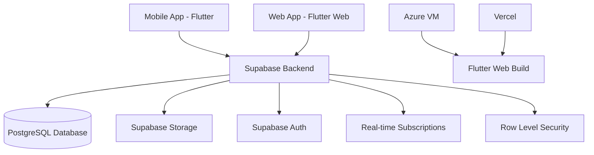

# 🎨 UNP Art Space

<div align="center">


**Galeri Seni Digital & Manajemen Pameran Kampus**

[](https://flutter.dev)
[](https://dart.dev)
[](https://supabase.com)
[](LICENSE)

[🌐 Live Demo](https://unp-art-space.vercel.app) • [📱 Download APK](https://vepmvxiddwmpetxfdwjn.supabase.co/storage/v1/object/public/downloads/app-release.apk) • [📖 Documentation](#-dokumentasi)

</div>

---

## 📋 Daftar Isi

- [✨ Tentang Aplikasi](#-tentang-aplikasi)
- [🎯 Fitur Utama](#-fitur-utama)
- [🖼️ Screenshots](#️-screenshots)
- [🏗️ Arsitektur](#️-arsitektur)
- [🚀 Instalasi & Setup](#-instalasi--setup)
- [💻 Tech Stack](#-tech-stack)
- [👥 Role & Permissions](#-role--permissions)
- [🎨 Design System](#-design-system)
- [📁 Struktur Project](#-struktur-project)
- [🔧 Development](#-development)
- [🌐 Deployment](#-deployment)
- [🤝 Kontribusi](#-kontribusi)
- [📄 License](#-license)

---

## ✨ Tentang Aplikasi

**UNP Art Space** adalah platform digital inovatif yang dirancang khusus untuk mahasiswa dan dosen Universitas Negeri Padang (UNP) dalam mengelola, mempamerkan, dan mengapresiasi karya seni digital. Aplikasi ini memfasilitasi ekosistem seni kampus yang interaktif dan modern.

### 🎯 Tujuan

- 🖼️ Menyediakan galeri digital untuk showcase karya seni mahasiswa
- 📅 Memudahkan manajemen event pameran seni virtual & offline
- 🤝 Membangun komunitas seniman di lingkungan kampus
- 📱 Memberikan akses mudah melalui mobile & web platform
- ✅ Menjamin kualitas konten melalui sistem approval admin

---

## 🎯 Fitur Utama

### 🎨 Untuk Artist (Seniman)

- ✅ **Upload Karya Seni** - Unggah karya dalam format gambar/video
- 🖼️ **Portfolio Digital** - Galeri pribadi dengan profil seniman
- 💬 **Interaksi Sosial** - Like, komentar, dan follow artist lain
- 📊 **Analytics Dashboard** - Lihat statistik views dan engagement
- 🏷️ **Kategorisasi** - Organisir karya berdasarkan kategori seni

### 📅 Untuk Event Organizer

- 📋 **Manajemen Event** - Buat dan kelola pameran seni virtual/offline
- 📝 **Registrasi Submission** - Terima karya untuk event tertentu
- 🎫 **QR Code System** - Generate QR untuk setiap karya di pameran
- 📊 **Dashboard Organizer** - Monitor statistik dan submission event
- 📢 **Announcements** - Broadcast pengumuman ke participants

### 👤 Untuk Viewer (Pengunjung)

- 🔍 **Explore Galeri** - Jelajahi karya seni dari berbagai seniman
- 💖 **Save Favorites** - Simpan karya favorit ke collection
- 💬 **Komentar & Like** - Berikan apresiasi pada karya seni
- 🔔 **Notifikasi** - Update terbaru dari artist & event
- 📱 **QR Scanner** - Scan QR di pameran untuk detail karya

### 🛡️ Untuk Admin

- ✅ **Content Moderation** - Approve/reject artwork submissions
- 👥 **User Management** - Kelola users dan role assignments
- 📊 **Analytics Dashboard** - Statistik lengkap platform
- 🏷️ **Category Management** - Atur kategori karya seni
- 📢 **Announcement System** - Broadcast info ke seluruh users

---

## 🖼️ Screenshots

<div align="center">

### 🎬 Onboarding & Authentication

| Splash Screen | Onboarding 1 | Onboarding 2 | Onboarding 3 |
|:---:|:---:|:---:|:---:|
|  |  |  |  |

| Login Screen |
|:---:|
|  |

### 🛡️ Admin Dashboard

| Admin Dashboard |
|:---:|
|  |

### 🎨 Artist Features

| Home Gallery | Artwork Detail | Event Detail | Profile Page |
|:---:|:---:|:---:|:---:|
|  |  |  |  |

### 📅 Organizer Features

| Organizer Home | Event Detail | Event Dashboard | QR Scanner |
|:---:|:---:|:---:|:---:|
|  |  |  |  |

</div>

---

## 🏗️ Arsitektur



### 🔐 Security Architecture

- **Row Level Security (RLS)** - Policy-based access control di database
- **JWT Authentication** - Secure token-based auth via Supabase
- **Role-Based Access** - 4 role: Admin, Artist, Organizer, Viewer
- **Email Verification** - Mandatory untuk aktivasi akun

---

## 🚀 Instalasi & Setup

### 📋 Prerequisites

- **Flutter SDK**: `>= 3.35.2`
- **Dart SDK**: `>= 3.6.0`
- **Android Studio** / **VS Code** dengan Flutter extension
- **Git** untuk version control

### 🔧 Setup Project

1️⃣ **Clone Repository**

```bash
git clone https://github.com/daffarobbani18/unp-art-space.git
cd unp-art-space
```

2️⃣ **Install Dependencies**

```bash
flutter pub get
```

3️⃣ **Setup Supabase Configuration**

Buat file `.env` di root project (opsional jika menggunakan environment variables):

```env
SUPABASE_URL=https://vepmvxiddwmpetxfdwjn.supabase.co
SUPABASE_ANON_KEY=your_anon_key_here
```

> **Note**: Untuk production, credentials sudah hardcoded di `lib/main/main_app.dart`

4️⃣ **Run Application**

**Mobile (Android/iOS):**
```bash
flutter run
```

**Web:**
```bash
flutter run -d chrome
```

**Build untuk Production:**
```bash
# Android APK
flutter build apk --release

# Web
flutter build web --release

# iOS (macOS only)
flutter build ios --release
```

---

## 💻 Tech Stack

### 🎨 Frontend

| Technology | Version | Purpose |
|------------|---------|---------|
|  | 3.35.2 | UI Framework |
|  | 3.6.0 | Programming Language |
|  | Latest | Design System |

### 🔧 Backend

| Technology | Purpose |
|------------|---------|
|  | Backend as a Service |
|  | Database |
|  | Authentication |
|  | File Storage |

### 📦 Key Dependencies

```yaml
dependencies:
  supabase_flutter: ^2.9.1        # Backend integration
  google_fonts: ^6.2.1            # Typography (Poppins)
  image_picker: ^1.1.2            # Media upload
  video_compress: ^3.1.3          # Video processing
  qr_flutter: ^4.1.0              # QR code generation
  mobile_scanner: ^5.2.3          # QR code scanner
  share_plus: ^10.1.3             # Share functionality
  url_launcher: ^6.3.1            # External URLs
  intl: ^0.19.0                   # Internationalization
  cached_network_image: ^3.4.1   # Image caching
```

### 🌐 Deployment

| Platform | URL | Purpose |
|----------|-----|---------|
| **Azure VM** | [Production](https://azure-vm-url) | Main production server |
| **Vercel** | [Staging](https://unp-art-space.vercel.app) | Development preview |
| **GitHub Actions** | - | CI/CD Pipeline |

---

## 👥 Role & Permissions

### 🎨 Artist
- ✅ Upload karya seni
- ✅ Edit/delete karya sendiri
- ✅ View analytics karya
- ✅ Submit ke event pameran
- ✅ Like & comment karya lain

### 📅 Event Organizer
- ✅ Semua permission Artist
- ✅ Create & manage events
- ✅ Approve/reject submissions
- ✅ Generate QR codes
- ✅ View event analytics

### 👤 Viewer
- ✅ Browse galeri
- ✅ Like & comment
- ✅ Follow artists
- ✅ Save favorites
- ✅ Scan QR codes

### 🛡️ Admin
- ✅ Semua permission di atas
- ✅ Approve/reject artworks
- ✅ User management
- ✅ Category management
- ✅ Platform-wide analytics
- ✅ Broadcast announcements

---

## 🎨 Design System

### 🎨 Color Palette

```dart
// Primary Colors
Primary Purple:   #8B5CF6
Primary Blue:     #3B82F6
Accent Orange:    #EA580C

// Background Gradients
Dark Purple:      #1E1E2C
Mid Purple:       #2D1B69
Deep Blue Dark:   #0F2027
```

### 🔤 Typography

**Font Family:** [Google Fonts Poppins](https://fonts.google.com/specimen/Poppins)

```dart
Headings:     Poppins Bold (28-32px)
Subheadings:  Poppins SemiBold (18-24px)
Body:         Poppins Regular (14-16px)
Captions:     Poppins Regular (12-13px)
```

### 🎭 UI Components

- **Glass Morphism**: Backdrop blur dengan opacity untuk cards
- **Gradient Buttons**: Linear gradient purple to blue
- **Smooth Animations**: Fade & slide transitions
- **Responsive Design**: Adaptive untuk mobile, tablet, desktop

---

## 📁 Struktur Project

```
unp-art-space-mobile/
├── 📱 android/                 # Android native code
├── 🍎 ios/                     # iOS native code
├── 🌐 web/                     # Web build config
├── 📦 lib/
│   ├── 🎨 app/
│   │   ├── Features/
│   │   │   ├── auth/          # Login, Register
│   │   │   ├── home/          # Home gallery
│   │   │   ├── artwork/       # Artwork CRUD & detail
│   │   │   ├── upload/        # Upload artwork
│   │   │   ├── profile/       # User profile
│   │   │   ├── search/        # Search & filter
│   │   │   └── notification/  # Push notifications
│   │   └── core/
│   │       ├── navigation/    # Routes & navigation
│   │       ├── screens/       # Splash, onboarding
│   │       └── utils/         # Helpers & constants
│   ├── 👔 admin/
│   │   └── screens/           # Admin dashboard & moderation
│   ├── 📅 organizer/
│   │   └── screens/           # Event management
│   ├── 🔧 shared/
│   │   └── widgets/           # Reusable components
│   ├── 🌐 pages/
│   │   └── web_landing_page.dart
│   └── 🚀 main/
│       ├── main_app.dart      # Mobile entry point
│       └── main_admin.dart    # Admin portal entry
├── 🎨 assets/
│   └── images/                # Logo & static images
├── 📜 schema.sql              # Database schema
├── 🔐 supabase_*.sql          # Supabase migrations
└── 📋 pubspec.yaml            # Dependencies
```

---

## 🔧 Development

### 🛠️ Common Commands

```bash
# Format code
flutter format .

# Analyze code
flutter analyze

# Clean build
flutter clean

# Get dependencies
flutter pub get

# Run on specific device
flutter run -d <device_id>

# Build APK
flutter build apk --release

# Build Web
flutter build web --release
```

### 🐛 Debugging Tips

1. **Hot Reload**: Press `r` di terminal saat app running
2. **Hot Restart**: Press `R` untuk full restart
3. **DevTools**: `flutter pub global run devtools`
4. **Logs**: `flutter logs` atau `adb logcat` (Android)

---

## 🌐 Deployment

### 📱 Mobile Deployment

**Android:**
1. Build APK: `flutter build apk --release`
2. Upload ke Supabase Storage: `/downloads/app-release.apk`
3. Update download URL di landing page

**iOS:**
1. Configure signing di Xcode
2. Build: `flutter build ios --release`
3. Upload ke App Store Connect

### 🌐 Web Deployment

**Azure VM (Production):**
```bash
# SSH to VM
ssh user@azure-vm-ip

# Navigate to project
cd /var/www/unp-art-space

# Pull latest changes
git pull origin main

# Build
flutter build web --release

# Restart web server
sudo systemctl restart nginx
```

**Vercel (Staging):**
- Auto-deploy on push to `main` branch
- URL: https://unp-art-space.vercel.app

### 🔄 CI/CD Pipeline (GitHub Actions)

Workflow: `.github/workflows/azure-deploy.yml`

**Triggers:**
- Push to `main` branch
- Manual workflow dispatch

**Steps:**
1. Checkout code
2. SSH to Azure VM
3. Git pull
4. Flutter pub get
5. Flutter build web
6. Deploy

---

## 📊 Database Schema

### 📋 Main Tables

```sql
profiles          # User profiles dengan role
artworks          # Karya seni dengan metadata
categories        # Kategori seni
artwork_likes     # Relasi likes
artwork_comments  # Komentar & replies
events            # Event pameran
event_submissions # Submission karya ke event
announcements     # Pengumuman platform
notifications     # User notifications
```

### 🔐 Row Level Security (RLS)

Semua table protected dengan RLS policies:
- Users hanya bisa edit data mereka sendiri
- Admin punya akses penuh ke semua data
- Organizers bisa manage event mereka
- Public read access untuk approved content

---

## 🤝 Kontribusi

Kami welcome kontribusi dari komunitas! 🎉

### 📝 How to Contribute

1. **Fork** repository ini
2. **Clone** fork kamu: `git clone https://github.com/your-username/unp-art-space-mobile.git`
3. **Create branch**: `git checkout -b feature/amazing-feature`
4. **Commit changes**: `git commit -m "feat: add amazing feature"`
5. **Push to branch**: `git push origin feature/amazing-feature`
6. **Open Pull Request** dengan deskripsi lengkap

### 📜 Commit Convention

Gunakan [Conventional Commits](https://www.conventionalcommits.org/):

```
feat:     New feature
fix:      Bug fix
docs:     Documentation changes
style:    Code style (formatting, semicolons, etc)
refactor: Code refactoring
test:     Adding tests
chore:    Maintenance tasks
```

### 🐛 Report Bug

Temukan bug? [Buat issue](https://github.com/daffarobbani18/unp-art-space-mobile/issues/new) dengan:
- Deskripsi bug yang jelas
- Steps to reproduce
- Expected vs actual behavior
- Screenshots (jika applicable)
- Device & OS info

---

## 👨‍💻 Developer

**Daffa Robbani**
- 📧 Email: d.robbani18@gmail.com
- 🐙 GitHub: [@daffarobbani18](https://github.com/daffarobbani18)
- 💼 LinkedIn: [Daffa Robbani](https://linkedin.com/in/daffarobbani)

**Universitas Negeri Padang**
- 📍 Padang, Sumatera Barat, Indonesia
- 🌐 Website: [unp.ac.id](https://unp.ac.id)

---

## 📄 License

```
MIT License

Copyright (c) 2025 Daffa Robbani - Universitas Negeri Padang

Permission is hereby granted, free of charge, to any person obtaining a copy
of this software and associated documentation files (the "Software"), to deal
in the Software without restriction, including without limitation the rights
to use, copy, modify, merge, publish, distribute, sublicense, and/or sell
copies of the Software, and to permit persons to whom the Software is
furnished to do so, subject to the following conditions:

The above copyright notice and this permission notice shall be included in all
copies or substantial portions of the Software.

THE SOFTWARE IS PROVIDED "AS IS", WITHOUT WARRANTY OF ANY KIND, EXPRESS OR
IMPLIED, INCLUDING BUT NOT LIMITED TO THE WARRANTIES OF MERCHANTABILITY,
FITNESS FOR A PARTICULAR PURPOSE AND NONINFRINGEMENT. IN NO EVENT SHALL THE
AUTHORS OR COPYRIGHT HOLDERS BE LIABLE FOR ANY CLAIM, DAMAGES OR OTHER
LIABILITY, WHETHER IN AN ACTION OF CONTRACT, TORT OR OTHERWISE, ARISING FROM,
OUT OF OR IN CONNECTION WITH THE SOFTWARE OR THE USE OR OTHER DEALINGS IN THE
SOFTWARE.
```

---

## 🌟 Acknowledgments

- **Flutter Team** - Framework yang amazing
- **Supabase Team** - Backend as a Service yang powerful
- **Universitas Negeri Padang** - Dukungan dan fasilitas
- **Open Source Community** - Inspirasi dan package dependencies

---

<div align="center">

### ⭐ Star this repo jika membantu!

Made with ❤️ by [Daffa Robbani](https://github.com/daffarobbani18)

**© 2025 UNP Art Space - Universitas Negeri Padang**

[🔝 Back to Top](#-unp-art-space)

</div>
