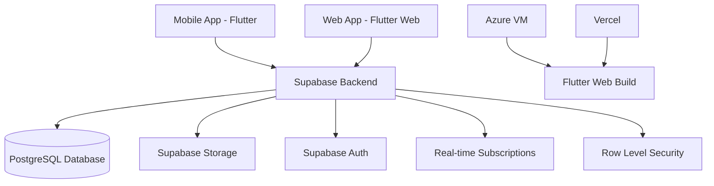

# 🎨 Campus Art Space

<div align="center">


**Modern Digital Art Gallery & Campus Exhibition Management Platform**

[](https://flutter.dev)
[](https://dart.dev)
[](https://supabase.com)
[](LICENSE)

[🌐 Live Demo](https://campus-art-space.vercel.app/) • [📱 Download APK](https://www.campus-art-space.daffaspace.me/) • [📖 Documentation](#-dokumentasi)
   

</div>

---

## 📋 Daftar Isi

- [✨ Tentang Aplikasi](#-tentang-aplikasi)
- [🎯 Fitur Utama](#-fitur-utama)
- [🖼️ Screenshots](#️-screenshots)
- [🏗️ Arsitektur](#️-arsitektur)
- [🚀 Instalasi & Setup](#-instalasi--setup)
- [💻 Tech Stack](#-tech-stack)
- [👥 Role & Permissions](#-role--permissions)
- [🎨 Design System](#-design-system)
- [📁 Struktur Project](#-struktur-project)
- [🔧 Development](#-development)
- [🌐 Deployment](#-deployment)
- [🤝 Kontribusi](#-kontribusi)
- [📄 License](#-license)

---

## ✨ About The Project

**Campus Art Space** is a comprehensive digital platform designed to revolutionize art exhibition management and community engagement in educational institutions. Built with Flutter and powered by Supabase, this full-stack application provides a complete ecosystem for artists, organizers, and art enthusiasts to connect, showcase, and appreciate digital artwork.

### 🎯 Project Goals

- 🖼️ **Digital Gallery**: Showcase student and faculty artwork in a modern, accessible format
- 📅 **Event Management**: Streamline virtual and physical art exhibition organization
- 🤝 **Community Building**: Foster an interactive artistic community within campus
- 📱 **Cross-Platform**: Seamless experience across mobile (Android/iOS) and web
- ✅ **Quality Assurance**: Curated content through admin moderation system
- 🎨 **Professional Portfolio**: Enable artists to build their digital presence

---

## ✨ Key Features

### 🎨 For Artists

- ✅ **Artwork Upload System** - Multi-format support (images, videos) with metadata management
- 🖼️ **Digital Portfolio** - Professional gallery showcase with artist profile and biography
- 💬 **Social Engagement** - Like, comment, and follow features with real-time interactions
- 📊 **Analytics Dashboard** - Track views, engagement metrics, and audience insights
- 🏷️ **Smart Categorization** - Organize artworks by categories with advanced filtering
- 📱 **Mobile-First Design** - Seamless experience across all devices

### 📅 For Event Organizers

- 📋 **Event Management** - Create and manage virtual/physical art exhibitions
- 📝 **Submission System** - Accept and curate artwork submissions for specific events
- 🎫 **QR Code Integration** - Generate unique QR codes for each exhibited artwork
- 📊 **Organizer Dashboard** - Monitor event statistics, submissions, and participant engagement
- 📢 **Announcement System** - Broadcast updates and notifications to event participants
- 📈 **Curation Tools** - Review, approve, or reject artwork submissions with feedback

### 👤 For Viewers

- 🔍 **Explore Gallery** - Browse artworks from various artists with advanced search and filters
- 💖 **Favorites Collection** - Save and organize favorite artworks in personal collections
- 💬 **Interactive Engagement** - Comment, like, and share appreciation for artworks
- 🔔 **Real-time Notifications** - Stay updated on new artworks, events, and artist activities
- 📱 **QR Code Scanner** - Scan QR codes at exhibitions to view detailed artwork information
- 🌐 **Multi-platform Access** - Seamless experience on mobile, tablet, and web

### 🛡️ For Administrators

- ✅ **Content Moderation** - Review and approve/reject artwork submissions with quality control
- 👥 **User Management** - Manage user accounts, roles, and permissions system-wide
- 📊 **Platform Analytics** - Comprehensive statistics dashboard with user, artwork, and event metrics
- 🏷️ **Category Management** - Create, edit, and organize artwork categories
- 📢 **Broadcast System** - Send platform-wide announcements to all users
- 🔐 **Security Controls** - Row-level security policies and access control management

---

## 🖼️ Screenshots

<div align="center">

### 🎬 Onboarding & Authentication

| Splash Screen | Onboarding 1 | Onboarding 2 | Onboarding 3 |
|:---:|:---:|:---:|:---:|
|  |  |  |  |

| Login Screen |
|:---:|
|  |

### 🛡️ Admin Dashboard

| Admin Dashboard |
|:---:|
|  |

### 🎨 Artist Features

| Home Gallery | Artwork Detail | Event Detail | Profile Page |
|:---:|:---:|:---:|:---:|
|  |  |  |  |

### 📅 Organizer Features

| Organizer Home | Event Detail | Event Dashboard | QR Scanner |
|:---:|:---:|:---:|:---:|
|  |  |  |  |

</div>

---

## 🏗️ Architecture Overview



### 🔐 Security Architecture

- **Row Level Security (RLS)** - Database-level policy-based access control for data isolation
- **JWT Authentication** - Secure token-based authentication via Supabase Auth
- **Role-Based Access Control (RBAC)** - Four distinct roles: Admin, Artist, Organizer, Viewer
- **Email Verification** - Mandatory email verification for account activation
- **Secure Storage** - Encrypted file storage with access control policies
- **API Rate Limiting** - Protection against abuse and unauthorized access

---

## 🚀 Installation & Setup

### 📋 Prerequisites

- **Flutter SDK**: `>= 3.35.2`
- **Dart SDK**: `>= 3.6.0`
- **Android Studio** or **VS Code** with Flutter extension
- **Git** for version control
- **Device/Emulator** for mobile testing

### 🔧 Project Setup

#### 1️⃣ Clone Repository

```bash
git clone https://github.com/daffarobbani18/unp-art-space.git
cd unp-art-space
```

#### 2️⃣ Install Dependencies

```bash
flutter pub get
```

#### 3️⃣ Supabase Configuration

Create a `.env` file in the project root (optional, for custom environments):

```env
SUPABASE_URL=https://vepmvxiddwmpetxfdwjn.supabase.co
SUPABASE_ANON_KEY=your_anon_key_here
```

> **Note**: Production credentials are configured in `lib/main/main_app.dart`

#### 4️⃣ Run Application

**Mobile Development (Android/iOS):**
```bash
flutter run
```

**Web Development:**
```bash
flutter run -d chrome
```

**Production Builds:**
```bash
# Android APK
flutter build apk --release

# Android App Bundle (for Play Store)
flutter build appbundle --release

# iOS (macOS only)
flutter build ios --release

# Web
flutter build web --release --target=lib/main/main_app.dart

# Admin Web Portal
flutter build web --release --target=lib/main/main_admin.dart
```

---

## 💻 Tech Stack

### 🎨 Frontend

| Technology | Version | Purpose |
|------------|---------|---------|
|  | 3.35.2 | UI Framework |
|  | 3.6.0 | Programming Language |
|  | Latest | Design System |

### 🔧 Backend

| Technology | Purpose |
|------------|---------|
|  | Backend as a Service |
|  | Database |
|  | Authentication |
|  | File Storage |

### 📦 Key Dependencies

```yaml
dependencies:
  supabase_flutter: ^2.9.1        # Backend integration
  google_fonts: ^6.2.1            # Typography (Poppins)
  image_picker: ^1.1.2            # Media upload
  video_compress: ^3.1.3          # Video processing
  qr_flutter: ^4.1.0              # QR code generation
  mobile_scanner: ^5.2.3          # QR code scanner
  share_plus: ^10.1.3             # Share functionality
  url_launcher: ^6.3.1            # External URLs
  intl: ^0.19.0                   # Internationalization
  cached_network_image: ^3.4.1   # Image caching
```

### 🌐 Deployment

| Platform | URL | Purpose |
|----------|-----|---------|
| **Azure VM** | [Production](https://azure-vm-url) | Main production server |
| **Vercel** | [Staging](https://unp-art-space.vercel.app) | Development preview |
| **GitHub Actions** | - | CI/CD Pipeline |

---

## 👥 Roles & Permissions

### 🎨 Artist
- ✅ Upload and manage artworks (images/videos)
- ✅ Edit or delete personal artworks
- ✅ View artwork analytics and engagement metrics
- ✅ Submit artworks to exhibition events
- ✅ Interact with other artworks (like, comment)
- ✅ Build and customize artist profile

### 📅 Event Organizer
- ✅ **All Artist permissions**, plus:
- ✅ Create and manage art exhibition events
- ✅ Review, approve, or reject artwork submissions
- ✅ Generate QR codes for exhibited artworks
- ✅ Access event analytics and participant insights
- ✅ Send announcements to event participants

### 👤 Viewer
- ✅ Browse and explore artwork galleries
- ✅ Like and comment on artworks
- ✅ Follow favorite artists
- ✅ Save artworks to personal favorites
- ✅ Scan QR codes at exhibitions
- ✅ Receive notifications on new content

### 🛡️ Administrator
- ✅ **All permissions from above roles**, plus:
- ✅ Moderate and approve/reject submitted artworks
- ✅ Manage users, roles, and account statuses
- ✅ Create and manage artwork categories
- ✅ Access platform-wide analytics dashboard
- ✅ Broadcast system-wide announcements
- ✅ Configure platform settings and policies

---

## 🎨 Design System

### 🎨 Color Palette

```dart
// Primary Colors
Primary Purple:   #8B5CF6
Primary Blue:     #3B82F6
Accent Orange:    #EA580C

// Background Gradients
Dark Purple:      #1E1E2C
Mid Purple:       #2D1B69
Deep Blue Dark:   #0F2027
```

### 🔤 Typography

**Font Family:** [Google Fonts Poppins](https://fonts.google.com/specimen/Poppins)

```dart
Headings:     Poppins Bold (28-32px)
Subheadings:  Poppins SemiBold (18-24px)
Body:         Poppins Regular (14-16px)
Captions:     Poppins Regular (12-13px)
```

### 🎭 UI Components

- **Glass Morphism Cards**: Backdrop blur with transparency for modern aesthetic
- **Gradient Buttons**: Smooth purple-to-blue gradients for CTAs
- **Smooth Animations**: Fade, slide, and scale transitions for fluid UX
- **Responsive Design**: Adaptive layouts for mobile, tablet, and desktop
- **Dark Theme**: Optimized for reduced eye strain and OLED displays
- **Material 3**: Google's latest design system with dynamic theming

---

## 📁 Project Structure

```
campus-art-space/
├── 📱 android/                 # Android native configuration
├── 🍎 ios/                     # iOS native configuration
├── 🌐 web/                     # Web build configuration
├── 📦 lib/
│   ├── 🎨 app/
│   │   ├── Features/
│   │   │   ├── auth/          # Authentication (Login, Register)
│   │   │   ├── home/          # Home gallery & feed
│   │   │   ├── artwork/       # Artwork CRUD & detail views
│   │   │   ├── upload/        # Artwork upload system
│   │   │   ├── profile/       # User profile management
│   │   │   ├── search/        # Search & advanced filters
│   │   │   └── notification/  # Real-time notifications
│   │   └── core/
│   │       ├── navigation/    # App routing & navigation
│   │       ├── screens/       # Splash, onboarding screens
│   │       └── utils/         # Helper functions & constants
│   ├── 👔 admin/
│   │   ├── screens/           # Admin dashboard & moderation
│   │   └── widgets/           # Admin-specific UI components
│   ├── 📅 organizer/
│   │   └── screens/           # Event management system
│   ├── 🔧 shared/
│   │   └── widgets/           # Reusable UI components
│   ├── 🌐 pages/
│   │   └── web_landing_page.dart  # Public landing page
│   └── 🚀 main/
│       ├── main_app.dart      # Mobile app entry point
│       └── main_admin.dart    # Admin web portal entry point
├── 🎨 assets/
│   └── images/                # App logo & static images
├── 📜 schema.sql              # PostgreSQL database schema
├── 🔐 supabase_*.sql          # Supabase migration scripts
└── 📋 pubspec.yaml            # Flutter dependencies & configuration
```

---

## 🔧 Development

### 🛠️ Common Commands

```bash
# Code Quality
flutter format .                  # Format code with Dart style
flutter analyze                   # Run static code analysis

# Dependency Management
flutter pub get                   # Install dependencies
flutter pub upgrade               # Upgrade packages
flutter pub outdated              # Check for outdated packages

# Build & Run
flutter clean                     # Clean build artifacts
flutter run                       # Run in debug mode
flutter run -d <device_id>        # Run on specific device
flutter devices                   # List connected devices

# Production Builds
flutter build apk --release       # Android APK
flutter build appbundle --release # Android App Bundle
flutter build web --release       # Web production build
flutter build ios --release       # iOS (macOS only)

# Testing
flutter test                      # Run unit tests
flutter test --coverage           # Generate coverage report
```

### 🐛 Debugging Tips

1. **Hot Reload**: Press `r` in terminal while app is running (instant UI updates)
2. **Hot Restart**: Press `R` for full app restart (preserves state)
3. **DevTools**: Run `flutter pub global run devtools` for advanced debugging
4. **Logs**: 
   - Flutter: `flutter logs`
   - Android: `adb logcat`
   - iOS: View logs in Xcode console
5. **Inspector**: Enable Flutter Inspector in VS Code or Android Studio
6. **Performance Profiling**: Use DevTools Performance tab for optimization

---

## 🌐 Deployment

### 📱 Mobile Deployment

#### Android
1. **Build Release APK/App Bundle:**
   ```bash
   flutter build apk --release              # For direct APK distribution
   flutter build appbundle --release        # For Google Play Store
   ```
2. **Upload to Distribution:**
   - Direct Download: Upload to Supabase Storage (`/downloads/app-release.apk`)
   - Google Play Store: Upload app bundle via Play Console
3. **Update Landing Page:** Update download URL in `web_landing_page.dart`

#### iOS
1. **Configure Code Signing:**
   - Open project in Xcode
   - Set up Team and Provisioning Profile
2. **Build for Distribution:**
   ```bash
   flutter build ios --release
   ```
3. **Upload to App Store:**
   - Archive in Xcode
   - Submit via App Store Connect

### 🌐 Web Deployment

#### Production (Azure VM)
```bash
# SSH into Azure VM
ssh user@your-azure-vm-ip

# Navigate to project directory
cd /var/www/campus-art-space

# Pull latest changes
git pull origin main

# Install/update dependencies
flutter pub get

# Build for production
flutter build web --release --target=lib/main/main_app.dart

# Restart Nginx server
sudo systemctl restart nginx
```

#### Staging (Vercel)
- **Auto-Deploy**: Automatically deploys on push to `main` branch
- **Manual Deploy**: Push to `staging` branch for preview
- **Preview URL**: https://campus-art-space.vercel.app

### 🔄 CI/CD Pipeline (GitHub Actions)

**Workflow File:** `.github/workflows/azure-deploy.yml`

**Triggers:**
- Push to `main` branch (auto-deploy)
- Pull request to `main` (build validation)
- Manual workflow dispatch (on-demand deploy)

**Pipeline Steps:**
1. ✅ Checkout source code
2. ✅ Setup Flutter environment
3. ✅ Install dependencies (`flutter pub get`)
4. ✅ Run code analysis (`flutter analyze`)
5. ✅ Build web application (`flutter build web --release`)
6. ✅ SSH into Azure VM
7. ✅ Deploy build artifacts
8. ✅ Restart web server (Nginx)
9. ✅ Send deployment notification

---

## 📊 Database Schema

### 📋 Main Tables

```sql
-- User Management
profiles          # User profiles with role-based access (artist, organizer, admin, viewer)

-- Artwork Management
artworks          # Artwork entries with metadata (title, description, category, status)
categories        # Art categories and classification system

-- Social Features
artwork_likes     # User likes on artworks (many-to-many relationship)
artwork_comments  # Comments and threaded replies on artworks

-- Event Management
events            # Art exhibition events (virtual/physical)
event_submissions # Artwork submissions for specific events

-- Communication
announcements     # Platform-wide announcements from admins
notifications     # Real-time user notifications

-- Analytics
artwork_views     # Track artwork view counts and engagement
event_analytics   # Event participation and submission statistics
```

### 🔐 Row Level Security (RLS)

All tables are protected with PostgreSQL Row Level Security policies:

- ✅ **Ownership-Based Access**: Users can only modify their own data
- ✅ **Role-Based Access**: Admin role has full CRUD access across all tables
- ✅ **Event Organizers**: Can manage their own events and submissions
- ✅ **Public Read Access**: Approved content is publicly viewable
- ✅ **Status-Based Filtering**: Only `approved` or `published` content visible to non-owners
- ✅ **Secure Mutations**: Create/Update/Delete operations require authentication

**Example RLS Policy:**
```sql
-- Users can only update their own artworks
CREATE POLICY "Users can update own artworks"
ON artworks FOR UPDATE
USING (auth.uid() = user_id);

-- Admins can view all artworks regardless of status
CREATE POLICY "Admins can view all artworks"
ON artworks FOR SELECT
USING (auth.jwt() ->> 'role' = 'admin');
```

---

## 🤝 Contributing

We welcome contributions from the community! 🎉

### 📝 How to Contribute

1. **Fork** this repository to your GitHub account
2. **Clone** your fork locally:
   ```bash
   git clone https://github.com/your-username/campus-art-space.git
   cd campus-art-space
   ```
3. **Create a feature branch**:
   ```bash
   git checkout -b feature/amazing-feature
   ```
4. **Make your changes** and commit using conventional commits:
   ```bash
   git commit -m "feat: add amazing feature"
   ```
5. **Push to your fork**:
   ```bash
   git push origin feature/amazing-feature
   ```
6. **Open a Pull Request** with a detailed description of your changes

### 📜 Commit Convention

We follow [Conventional Commits](https://www.conventionalcommits.org/) specification:

```
feat:     New feature implementation
fix:      Bug fix
docs:     Documentation updates
style:    Code style changes (formatting, whitespace)
refactor: Code refactoring without functionality changes
test:     Adding or updating tests
chore:    Maintenance tasks, dependency updates
perf:     Performance improvements
ci:       CI/CD configuration changes
```

**Examples:**
```bash
feat(artwork): add video upload support
fix(auth): resolve login redirect issue
docs(readme): update installation instructions
```

### 🐛 Report Bugs

Found a bug? [Create an issue](https://github.com/daffarobbani18/campus-art-space/issues/new) with:
- ✅ Clear bug description
- ✅ Steps to reproduce
- ✅ Expected vs actual behavior
- ✅ Screenshots (if applicable)
- ✅ Device & OS information
- ✅ Flutter/Dart version

### 💡 Feature Requests

Have an idea? [Open a feature request](https://github.com/daffarobbani18/campus-art-space/issues/new) with:
- ✅ Clear feature description
- ✅ Use case and benefits
- ✅ Proposed implementation (optional)
- ✅ Mockups or wireframes (if applicable)

---

## 👨‍💻 Developer

**Daffa Robbani**
- 📧 Email: [d.robbani18@gmail.com](mailto:d.robbani18@gmail.com)
- 🐙 GitHub: [@daffarobbani18](https://github.com/daffarobbani18)
- 💼 LinkedIn: [Daffa Robbani](https://linkedin.com/in/daffarobbani)
- 🌐 Portfolio: [daffarobbani.dev](https://daffarobbani.dev) *(if applicable)*

**Academic Affiliation**
- 🎓 **Institution**: Universitas Negeri Padang (UNP)
- 📍 **Location**: Padang, West Sumatra, Indonesia
- 🌐 **Website**: [unp.ac.id](https://unp.ac.id)

---

## 📄 License

```
MIT License

Copyright (c) 2025 Daffa Robbani - Universitas Negeri Padang

Permission is hereby granted, free of charge, to any person obtaining a copy
of this software and associated documentation files (the "Software"), to deal
in the Software without restriction, including without limitation the rights
to use, copy, modify, merge, publish, distribute, sublicense, and/or sell
copies of the Software, and to permit persons to whom the Software is
furnished to do so, subject to the following conditions:

The above copyright notice and this permission notice shall be included in all
copies or substantial portions of the Software.

THE SOFTWARE IS PROVIDED "AS IS", WITHOUT WARRANTY OF ANY KIND, EXPRESS OR
IMPLIED, INCLUDING BUT NOT LIMITED TO THE WARRANTIES OF MERCHANTABILITY,
FITNESS FOR A PARTICULAR PURPOSE AND NONINFRINGEMENT. IN NO EVENT SHALL THE
AUTHORS OR COPYRIGHT HOLDERS BE LIABLE FOR ANY CLAIM, DAMAGES OR OTHER
LIABILITY, WHETHER IN AN ACTION OF CONTRACT, TORT OR OTHERWISE, ARISING FROM,
OUT OF OR IN CONNECTION WITH THE SOFTWARE OR THE USE OR OTHER DEALINGS IN THE
SOFTWARE.
```

---

## 🌟 Acknowledgments

- **Flutter Team** - For the amazing cross-platform framework
- **Supabase Team** - For providing a powerful and developer-friendly BaaS
- **Universitas Negeri Padang** - For academic support and resources
- **Open Source Community** - For the incredible packages and libraries that made this project possible
- **Google Fonts** - For the beautiful Poppins typography
- **Contributors** - Everyone who has contributed to improving this platform

---

<div align="center">

### ⭐ Star this repo jika membantu!

Made with ❤️ by [Daffa Robbani](https://github.com/daffarobbani18)

**© 2025 UNP Art Space - Universitas Negeri Padang**

[🔝 Back to Top](#-unp-art-space)

</div>
